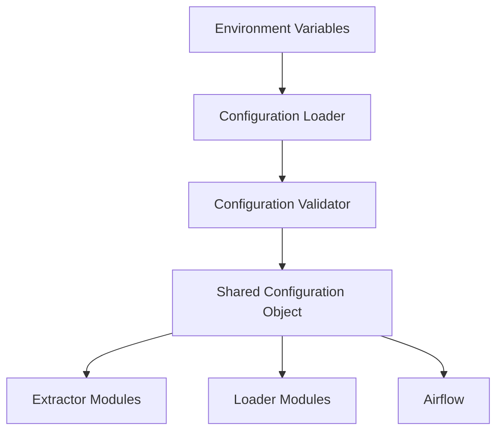

# SPEC-002: Configuration Management

## 1. Specification Overview

### Spec ID
SPEC-002

### Module Name
Configuration Management

### Purpose
Centralize runtime configuration for all ETL modules, including environment variables, defaults, and service connection settings.

### Description
This module defines how the application loads configuration values, separates environment-specific settings, and exposes configuration to extractors, validators, transformers, loaders, Airflow, Docker, and Terraform-related workflows.

### Business Goal
Reduce misconfiguration risk and support predictable deployment across development, test, and production environments.

### Scope
- Configuration loading strategy
- Environment variable usage
- Secret handling guidance
- Default values and overrides

### Out of Scope
- Secret vault integration
- Dynamic runtime configuration management

### Priority
High

### Estimated Complexity
Medium

---

## 2. Objectives
- Provide a single access pattern for configuration values.
- Ensure configuration is environment-aware.
- Support safe handling of credentials and secrets.
- Make configuration defaults explicit and testable.

---

## 3. Functional Requirements
1. FR-001: The module shall provide a centralized configuration interface for all services.
2. FR-002: Configuration values shall be loaded from environment variables and local environment files.
3. FR-003: The module shall define defaults for all required values when environment variables are absent.
4. FR-004: Configuration values shall be validated for required presence before use.
5. FR-005: The module shall support separate values for local, staging, and production deployments.
6. FR-006: Sensitive values shall be marked and handled without being emitted in logs or diagnostics.
7. FR-007: Configuration changes shall be discoverable through documentation and environment examples.

---

## 4. Non Functional Requirements
### Performance
- Configuration loading should be lightweight and occur once per process.

### Reliability
- Missing required configuration must fail early and clearly.

### Maintainability
- Configuration structure must be simple and documented.

### Scalability
- Additional services and environment variables should be easy to add.

### Security
- Secrets must not be committed or logged in plaintext.

### Logging
- Configuration loading events should be logged at startup without exposing secrets.

### Error Handling
- Invalid configuration must yield actionable errors.

### Configuration
- Defaults and override patterns must be documented.

### Testing
- Configuration loading must be covered by tests for defaults and overrides.

---

## 5. Module Responsibilities
- Load configuration from environment files and runtime variables.
- Validate required settings.
- Expose configuration to the rest of the system.
- Prevent secret leakage.

---

## 6. Inputs
- Environment variables.
- .env files.
- Deployment environment context.
- Service-specific settings.

---

## 7. Outputs
- Configuration object or context.
- Validation errors for missing or malformed values.
- Runtime settings consumed by modules.

---

## 8. Internal Components
### Configuration Loader
Purpose: Read configuration from external sources.

Responsibilities:
- Load variables.
- Apply defaults.
- Validate values.

### Configuration Validator
Purpose: Ensure required settings are present and valid.

Responsibilities:
- Enforce required keys.
- Apply type checks.

---

## 9. File Structure
- config/settings/ — shared settings module.
- config/env/ — environment templates and example files.

---

## 10. Public Interfaces
### ConfigurationProvider
Purpose: Supply configuration values.
Parameters: key, default, environment context.
Return Value: resolved configuration value.
Exceptions: MissingConfigurationError, InvalidConfigurationError.

---

## 11. Data Flow
Configuration values are loaded at startup and passed to dependent modules.

---

## 12. Error Handling Strategy
- Missing required values must cause a controlled startup failure.
- Invalid types should raise an explicit configuration error.
- Secret values must never be printed in full.

---

## 13. Configuration
### Environment Variables
- POSTGRES_DB
- POSTGRES_USER
- POSTGRES_PASSWORD
- POSTGRES_HOST
- POSTGRES_PORT
- MONGO_URI
- MONGO_DB
- AIRFLOW__CORE__EXECUTOR

### Defaults
- Localhost defaults for local development where appropriate.
- Safe defaults for non-sensitive settings.

---

## 14. Logging Strategy
- Log only configuration status and missing keys, not sensitive values.
- Emit startup warnings for missing optional values.

---

## 15. Testing Strategy
- Unit tests for default and override behavior.
- Negative tests for missing and invalid values.
- Environment-based integration tests.
- pytest tests/unit/test_config.py   (run this command to for testing)
-

---

## 16. Dependencies
- python-dotenv
- Standard library configuration loader support

---

## 17. Risks
- Environment drift between services.
- Secret leakage in logs or config files.

---

## 18. Sprint Breakdown
### Sprint 1
Goal: Define configuration contract.
Tasks: Define settings, defaults, and environment file structure.
Deliverables: Configuration schema and documentation.
Exit Criteria: Modules can consume configuration consistently.

---

## 19. Daily Development Plan
### Day 1
Objectives: Define settings inventory.
Tasks: List required variables and defaults.
Expected Deliverables: Configuration inventory.
Files Expected: config/settings/ and config/env/.
Acceptance Criteria: All modules have a clear configuration contract.

---

## 20. Acceptance Criteria
- [ ] Configuration values are centralized.
- [ ] Defaults and overrides are documented.
- [ ] Missing values fail clearly.
- [ ] Secrets remain protected.

---

## 21. Future Enhancements
- Support external secret management systems.
- Add configuration versioning.
