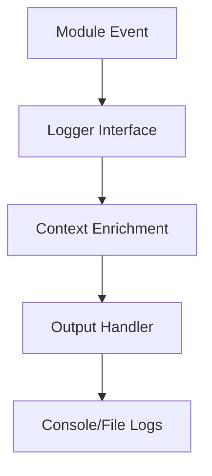

# SPEC-003: Logging

## 1. Specification Overview

### Spec ID
SPEC-003

### Module Name
Logging

### Purpose
Define and implement a consistent logging strategy across the ETL application, orchestration, and infrastructure-related components.

### Description
This module standardizes how the application records execution events, warnings, validation outcomes, errors, and operational milestones. The logging framework must support both developers and operators.

### Business Goal
Improve observability, accelerate troubleshooting, and support auditability of ETL runs.

### Scope
- Logging standards and levels
- Structured log messages
- Context enrichment
- Failure logging
- Operational audit logging

### Out of Scope
- Central log aggregation platform integration
- User-facing dashboards

### Priority
High

### Estimated Complexity
Medium

---

## 2. Objectives
- Standardize logging across all modules.
- Ensure logs contain context required for debugging.
- Make logs useful for both development and operations.
- Support traceability of ETL runs and failures.

---

## 3. Functional Requirements
1. FR-001: The logging module shall expose a standard logger interface for all application modules.
2. FR-002: Logs shall include timestamps, log level, module name, and execution context.
3. FR-003: Logs shall support structured fields for batch IDs, source type, record ID, and status.
4. FR-004: Warning and error logs shall capture enough detail to support root cause analysis.
5. FR-005: The module shall distinguish informational events from validation failures and infrastructure issues.
6. FR-006: The logging mechanism shall handle exception-based events without exposing secrets.
7. FR-007: The logging strategy shall support both console and file-based output.

---

## 4. Non Functional Requirements
### Performance
- Logging overhead should stay minimal relative to ETL processing.

### Reliability
- Logging should never block core ETL execution unexpectedly.

### Maintainability
- Logging format shall be centrally defined and reused.

### Scalability
- The logging strategy shall support increased workload and additional services.

### Security
- Sensitive values must be redacted from logs.

### Logging
- Structured and consistent JSON or key-value logs are preferred.

### Error Handling
- Logging failures must not crash the pipeline.

### Configuration
- Log level and output destination shall be configurable.

### Testing
- Logging output should be covered by tests.

---

## 5. Module Responsibilities
- Provide shared logger setup.
- Standardize log formatting.
- Emit operational and error logs.
- Support correlation across ETL tasks.

---

## 6. Inputs
- Module events.
- Exceptions.
- Runtime metadata.
- Configuration values.

---

## 7. Outputs
- Console and file logs.
- Structured logs for monitoring and debugging.
- Error and audit events.

---

## 8. Internal Components
### Logger Factory
Purpose: Create logger instances for each module.

Responsibilities:
- Configure log format.
- Attach context handlers.

### Context Enricher
Purpose: Add runtime context to each log entry.

Responsibilities:
- Add source, batch, and run identifiers.

---

## 9. File Structure
- etl/utils/logging.py — shared logging interface.
- config/settings/logging.conf or equivalent configuration placeholder — shared logging configuration.

---

## 10. Public Interfaces
### get_logger
Purpose: Return a configured logger instance.
Parameters: module_name, context.
Return Value: Logger object.
Exceptions: None.

---

## 11. Data Flow
Log events are emitted by modules and enriched before being written to outputs.

---

## 12. Error Handling Strategy
- Logger initialization failures must be non-blocking where possible.
- Exceptions in logging should not interrupt ETL processing.

---

## 13. Configuration
### Environment Variables
- LOG_LEVEL
- LOG_FORMAT
- LOG_OUTPUT_PATH

### Defaults
- INFO level by default.
- Console output enabled.

---

## 14. Logging Strategy
- Use structured logging with standardized fields.
- Log start, completion, validation result, load outcome, failures, retries, and task state transitions.
- Keep sensitive fields masked.

---

## 15. Testing Strategy
- Unit tests for log formatting and context enrichment.
- Integration tests verifying emitted fields.

---

## 16. Dependencies
- Standard Python logging library.

---

## 17. Risks
- Inconsistent log fields across modules.
- Logging too much sensitive content.

---

## 18. Sprint Breakdown
### Sprint 1
Goal: Establish logging framework.
Tasks: Define conventions and shared logger interface.
Deliverables: Shared logging module.
Exit Criteria: Core modules can write logs consistently.

---

## 19. Daily Development Plan
### Day 1
Objectives: Define logging requirements.
Tasks: List required fields and levels.
Expected Deliverables: Logging specification draft.
Files Expected: etl/utils/logging.py.
Acceptance Criteria: Shared logging contract exists.

---

## 20. Acceptance Criteria
- [ ] Logging is consistent across modules.
- [ ] Structured fields are present.
- [ ] Secrets are redacted.
- [ ] Failures are logged clearly.

---

## 21. Future Enhancements
- Integrate with centralized observability platforms.
- Add correlation IDs across services.
