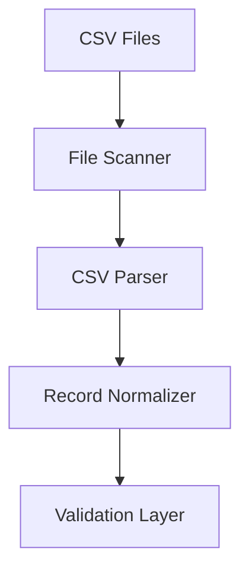

# SPEC-004: CSV Extractor

## 1. Specification Overview

### Spec ID
SPEC-004

### Module Name
CSV Extractor

### Purpose
Read and normalize data from CSV files into a structured object model for downstream validation and transformation.

### Description
This module handles CSV file intake, input discovery, parsing, type normalization, and metadata enrichment before records are passed to the validation layer.

### Business Goal
Enable ETL ingestion from file-based source data with predictable parsing and validation behavior.

### Scope
- File discovery and ingestion
- Parsing CSV content
- Record normalization
- Basic error handling for malformed files

### Out of Scope
- Complex spreadsheet processing
- Non-CSV file formats

### Priority
High

### Estimated Complexity
Medium

---

## 2. Objectives
- Ingest CSV files reliably.
- Deliver structured records for validation.
- Support reusable parsing behavior for multiple CSV sources.

---

## 3. Functional Requirements
1. FR-001: The module shall locate CSV files from a configured source location.
2. FR-002: The module shall parse CSV files using a configurable delimiter and encoding.
3. FR-003: The module shall map each row into an intermediate record structure.
4. FR-004: The module shall preserve source metadata such as filename and ingestion timestamp.
5. FR-005: The module shall report malformed rows or files without stopping the full batch unnecessarily.
6. FR-006: The module shall support processing of multiple files in a single run.
7. FR-007: The module shall output records in a format acceptable to the validation layer.

---

## 4. Non Functional Requirements
### Performance
- Must process files efficiently for moderate batch sizes.

### Reliability
- File parsing should be resilient to common format issues.

### Maintainability
- Parsing rules should be easily configurable.

### Security
- File paths must be validated to prevent directory traversal issues.

### Logging
- Parsing failures and skipped rows must be logged.

### Error Handling
- invalid rows should be isolated and reported.

### Configuration
- Source location, delimiter, and encoding should be configurable.

### Testing
- Covered by unit and integration tests.

---

## 5. Module Responsibilities
- Discover source files.
- Parse and normalize records.
- Attach metadata.
- Produce validation-ready output.

---

## 6. Inputs
- CSV files.
- Configuration values for paths, delimiters, and headers.

---

## 7. Outputs
- Structured records.
- Parsing errors and skipped-row reports.
- Batch summary metadata.

---

## 8. Internal Components
### File Scanner
Purpose: Find eligible CSV files.

Responsibilities:
- Discover files from configured directories.

### CSV Parser
Purpose: Parse file contents into records.

Responsibilities:
- Map rows to field names.

### Record Normalizer
Purpose: Standardize extraction output.

Responsibilities:
- Apply default values and metadata enrichment.

---

## 9. File Structure
- etl/extractors/csv_extractor.py — main CSV extraction workflow.
- etl/extractors/base.py — shared extraction interface.
- tests/unit/extractors/test_csv_extractor.py — unit tests.

---

## 10. Public Interfaces
### CSVExtractor
Purpose: Extract records from CSV files.
Parameters: file paths, configuration.
Return Value: list of structured records plus metadata.
Exceptions: FileNotFoundError, CSVParseError.

---

## 11. Data Flow

---

## 12. Error Handling Strategy
- Corrupt files should be reported and skipped.
- Bad rows should not stop the entire extraction process unless configured.

---

## 13. Configuration
### Environment Variables
- CSV_INPUT_PATH
- CSV_DELIMITER
- CSV_ENCODING
- CSV_HAS_HEADER

---

## 14. Logging Strategy
- Log file discovery results.
- Log malformed rows and skipped files.

---

## 15. Testing Strategy
- Unit tests for parser behavior.
- Integration tests using sample CSV files.

---

## 16. Dependencies
- pandas
- Standard library file handling

---

## 17. Risks
- Inconsistent headers or formatting.
- Encoding issues.

---

## 18. Sprint Breakdown
### Sprint 1
Goal: Create initial CSV extraction flow.
Tasks: File scanning and row parsing.
Deliverables: Basic extractor.
Exit Criteria: Sample CSV files can be parsed into structured records.

---

## 19. Daily Development Plan
### Day 1
Objectives: Define parsing behavior.
Tasks: Review sample files and define required configuration.
Expected Deliverables: Parsing contract.
Files Expected: etl/extractors/csv_extractor.py.
Acceptance Criteria: Team agrees on supported CSV assumptions.

---

## 20. Acceptance Criteria
- [ ] CSV files are discovered and parsed.
- [ ] Records are emitted in validation-ready format.
- [ ] Malformed input is handled gracefully.

---

## 21. Future Enhancements
- Support compressed CSV files.
- Add schema inference for unknown files.
