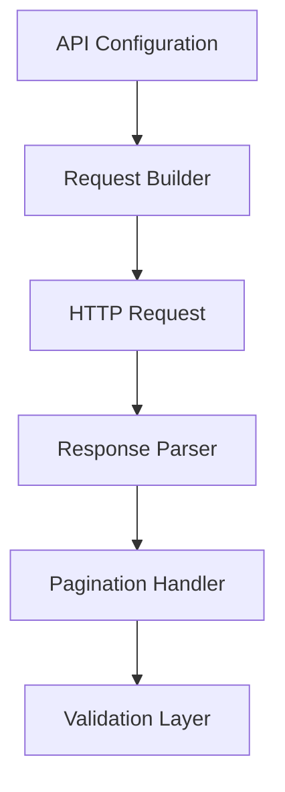

# SPEC-005: REST API Extractor

## 1. Specification Overview

### Spec ID
SPEC-005

### Module Name
REST API Extractor

### Purpose
Retrieve data from REST-based endpoints and convert it into a format suitable for validation and transformation.

### Description
This module is responsible for making outbound HTTP requests to configured APIs, handling authentication and pagination, and normalizing the resulting payload into a record list.

### Business Goal
Enable ETL ingestion from API-based sources without manual intervention.

### Scope
- API request execution
- Authentication support
- Payload normalization
- Pagination and retry handling

### Out of Scope
- Real-time streaming APIs
- UI-based API management

### Priority
High

### Estimated Complexity
Medium

---

## 2. Objectives
- Retrieve data from REST APIs consistently.
- Normalize API payloads into a standard intermediate format.
- Handle common API failures gracefully.

---

## 3. Functional Requirements
1. FR-001: The module shall send HTTP requests to configured endpoints.
2. FR-002: The module shall support configurable request methods, headers, and query parameters.
3. FR-003: The module shall normalize JSON responses into structured records.
4. FR-004: The module shall support pagination when the API provides page-based results.
5. FR-005: The module shall support authentication strategies defined through configuration.
6. FR-006: The module shall report API failures and non-success response statuses clearly.
7. FR-007: The module shall preserve timestamps and response metadata for traceability.

---

## 4. Non Functional Requirements
### Performance
- Requests should be efficient and support batching where feasible.

### Reliability
- Temporary failures must be handled without losing the full extraction run.

### Maintainability
- Endpoint-specific behavior must be isolated and documented.

### Security
- Credentials must not be exposed in logs or errors.

### Logging
- Request and response statuses should be logged.

### Error Handling
- Network and HTTP errors should be managed with explicit error objects.

### Configuration
- Endpoint, auth, timeout, and pagination settings must be configurable.

### Testing
- Tests should cover success, failure, pagination, and authentication scenarios.

---

## 5. Module Responsibilities
- Prepare API request definitions.
- Execute outbound requests.
- Transform payloads into validation-ready records.
- Handle retries and failures.

---

## 6. Inputs
- API endpoint configurations.
- Authentication settings.
- Request parameters and payloads.

---

## 7. Outputs
- Structured record list.
- API response metadata.
- Access and failure logs.

---

## 8. Internal Components
### Request Builder
Purpose: Prepare request details.

Responsibilities:
- Build requests from configuration.

### Response Parser
Purpose: Convert API responses to records.

Responsibilities:
- Normalize content into record structures.

### Pagination Handler
Purpose: Continue through pages until complete.

Responsibilities:
- Iterate through API results.

---

## 9. File Structure
- etl/extractors/api_extractor.py — main API extractor logic.
- tests/unit/extractors/test_api_extractor.py — unit tests.

---

## 10. Public Interfaces
### APIExtractor
Purpose: Extract records from a REST API.
Parameters: endpoint configuration, request context.
Return Value: normalized records and metadata.
Exceptions: APIRequestError, APIResponseError, AuthenticationError.

---

## 11. Data Flow

---

## 12. Error Handling Strategy
- Non-2xx responses must produce explicit errors.
- Timeouts and transient network issues should be retried within configured limits.
- Invalid payloads should be surfaced with context.

---

## 13. Configuration
### Environment Variables
- API_BASE_URL
- API_TIMEOUT
- API_AUTH_TOKEN
- API_PAGE_SIZE

---

## 14. Logging Strategy
- Log request initiation, success, failure, and pagination progress.
- Do not log secrets or tokens.

---

## 15. Testing Strategy
- Unit tests for request preparation and normalization.
- Integration tests using mocked API responses.

---

## 16. Dependencies
- requests

---

## 17. Risks
- Unstable endpoints.
- Authentication changes.
- Pagination ambiguity.

---

## 18. Sprint Breakdown
### Sprint 1
Goal: Implement baseline API ingestion.
Tasks: Request building and response parsing.
Deliverables: Functional API extractor.
Exit Criteria: Sample API responses are normalized into records.

---

## 19. Daily Development Plan
### Day 1
Objectives: Define endpoint contract.
Tasks: Review API payload examples and define normalization rules.
Expected Deliverables: Request and response contract.
Files Expected: etl/extractors/api_extractor.py.
Acceptance Criteria: Supported API behavior is documented.

---

## 20. Acceptance Criteria
- [ ] API requests execute successfully with configured settings.
- [ ] Records are normalized correctly.
- [ ] Errors are surfaced with context.

---

## 21. Future Enhancements
- Support OAuth2 flows.
- Add automatic schema discovery from response examples.
