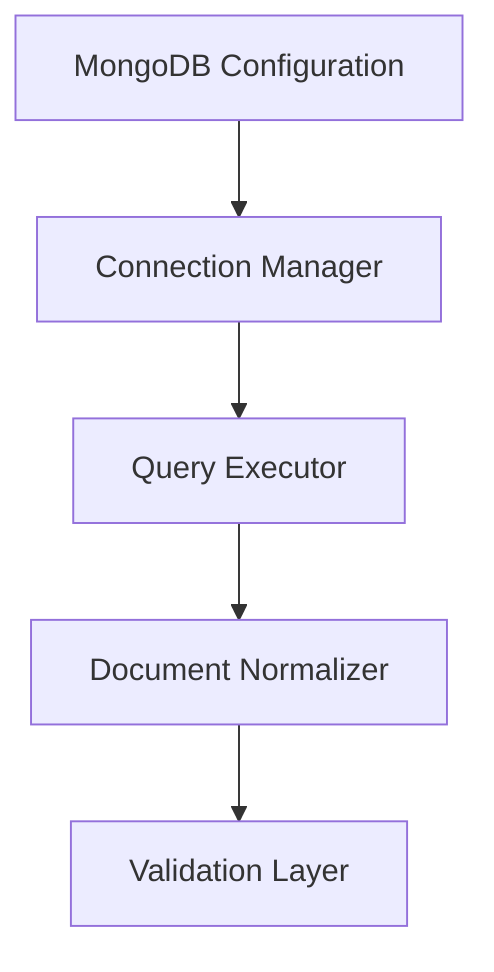

# SPEC-006: MongoDB Extractor

## 1. Specification Overview

### Spec ID
SPEC-006

### Module Name
MongoDB Extractor

### Purpose
Retrieve data from MongoDB collections and transform it into a standardized record structure for downstream validation.

### Description
This module establishes connectivity to MongoDB, executes queries against configured collections, and normalizes the returned documents into a record list that can be validated and transformed.

### Business Goal
Allow the ETL pipeline to ingest document-based data from MongoDB in a consistent and reliable manner.

### Scope
- MongoDB connection handling
- Query execution
- Document normalization
- Error and connection handling

### Out of Scope
- MongoDB aggregation pipeline design beyond basic extraction
- Full database administration operations

### Priority
High

### Estimated Complexity
Medium

---

## 2. Objectives
- Connect to MongoDB securely and reliably.
- Extract documents from configured collections.
- Produce normalized records for validation.

---

## 3. Functional Requirements
1. FR-001: The module shall connect to MongoDB using configured connection settings.
2. FR-002: The module shall execute queries against one or more configured collections.
3. FR-003: The module shall normalize MongoDB documents into a standard intermediate record structure.
4. FR-004: The module shall preserve metadata such as collection name and extraction timestamp.
5. FR-005: The module shall handle connection and query failures explicitly.
6. FR-006: The module shall support filtering and document selection using configuration-based query parameters.
7. FR-007: The module shall emit records in a format compatible with the validation service.

---

## 4. Non Functional Requirements
### Performance
- Extraction should be efficient for typical document batches.

### Reliability
- Connection failures should be surfaced clearly and handled gracefully.

### Maintainability
- Collection-specific logic should be isolated and configurable.

### Security
- Connection strings and credentials must be handled securely.

### Logging
- Connection attempts, query results, and failures should be logged.

### Error Handling
- Query and connection errors should be explicit and recoverable.

### Configuration
- Host, database, and collection settings must be configurable.

### Testing
- Tests should cover success, query filtering, and failure scenarios.

---

## 5. Module Responsibilities
- Manage MongoDB connections.
- Execute extraction queries.
- Normalize documents.
- Report extraction errors.

---

## 6. Inputs
- MongoDB connection settings.
- Collection names and filter parameters.
- Optional query projection and limits.

---

## 7. Outputs
- Structured document records.
- Extraction metadata.
- Error objects for failed operations.

---

## 8. Internal Components
### Connection Manager
Purpose: Create and maintain MongoDB client connections.

Responsibilities:
- Establish the connection.
- Manage connection lifecycle.

### Query Executor
Purpose: Run document retrieval operations.

Responsibilities:
- Execute collection queries.
- Apply filtering and projection.

### Document Normalizer
Purpose: Convert MongoDB documents into ETL-friendly records.

Responsibilities:
- Remove internal metadata if required.
- Attach processing context.

---

## 9. File Structure
- etl/extractors/mongo_extractor.py — main MongoDB extractor logic.
- tests/unit/extractors/test_mongo_extractor.py — unit tests.

---

## 10. Public Interfaces
### MongoExtractor
Purpose: Extract records from MongoDB.
Parameters: connection settings, collection configuration, query context.
Return Value: normalized records and metadata.
Exceptions: ConnectionError, QueryExecutionError.

---

## 11. Data Flow

---

## 12. Error Handling Strategy
- Connection failures should be logged and surfaced.
- Query errors should not stop unrelated extraction work if configured to continue.

---

## 13. Configuration
### Environment Variables
- MONGO_URI
- MONGO_DB
- MONGO_COLLECTION
- MONGO_QUERY_LIMIT

---

## 14. Logging Strategy
- Log connection attempts and query execution outcomes.
- Log collection and document count summaries.

---

## 15. Testing Strategy
- Unit tests for connection configuration and normalization.
- Integration tests using a test database or mocked client.

---

## 16. Dependencies
- pymongo

---

## 17. Risks
- Connection instability.
- Schema variability within collections.

---

## 18. Sprint Breakdown
### Sprint 1
Goal: Implement baseline MongoDB extraction.
Tasks: Connection management and document query execution.
Deliverables: Functional MongoDB extractor.
Exit Criteria: Sample documents can be retrieved and normalized.

---

## 19. Daily Development Plan
### Day 1
Objectives: Define retrieval contract.
Tasks: Review sample collections and required query behavior.
Expected Deliverables: Extraction contract.
Files Expected: etl/extractors/mongo_extractor.py.
Acceptance Criteria: Supported collection behaviors are documented.

---

## 20. Acceptance Criteria
- [ ] MongoDB connections are established correctly.
- [ ] Records are normalized for validation.
- [ ] Connection and query failures are handled explicitly.

---

## 21. Future Enhancements
- Add support for aggregation pipelines.
- Add incremental extraction capability.
