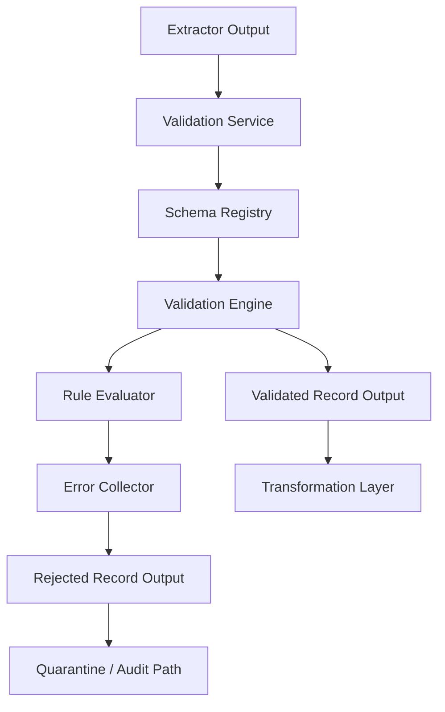

# SPEC-007: Pydantic Validation Layer

## 1. Specification Overview

### Spec ID
SPEC-007

### Module Name
Pydantic Validation Layer

### Purpose
To validate raw records extracted from CSV, REST API, and MongoDB sources using a consistent Pydantic-based validation framework before transformation and loading.

### Description
This module is responsible for enforcing schema correctness, required field presence, data type integrity, range and format constraints, and source-specific business rules on incoming records. It converts raw extracted data into a validated, structured representation that downstream transformation and loading components can consume safely.

### Business Goal
Reduce data quality issues, prevent invalid records from entering the PostgreSQL store, and create a consistent quality gate for all ETL workflows.

### Scope
- Validate records from CSV, REST API, and MongoDB extractors
- Apply shared and source-specific validation rules
- Produce structured validation results with pass/fail outcomes
- Generate actionable validation errors for rejected records
- Support batch and single-record validation flows
- Integrate with Airflow workflow and downstream transformation modules

### Out of Scope
- Data transformation logic
- Database write operations
- Data profiling and anomaly detection
- User interface for viewing validation results
- Real-time streaming validation

### Priority
High

### Estimated Complexity
Medium to High

---

## 2. Objectives

This module must accomplish the following objectives:

1. Validate incoming records from all supported data sources using a shared validation framework.
2. Enforce mandatory fields, data types, and regional or business-specific constraints.
3. Reject invalid records without blocking the overall pipeline unnecessarily.
4. Preserve enough metadata to explain why a record failed validation.
5. Produce a normalized output structure suitable for transformation.
6. Ensure validation behavior is deterministic, testable, and extensible.
7. Provide consistent logging and error reporting for operational visibility.

---

## 3. Functional Requirements

### FR-001: Source-Agnostic Validation Entry Point
The module shall expose a single validation entry point that can accept records from CSV, API, and MongoDB extractors in a normalized input format.

### FR-002: Schema-Based Validation
The module shall validate each incoming record against one or more defined Pydantic schemas depending on the source type and record category.

### FR-003: Required Field Enforcement
The module shall enforce that all required fields are present before a record is accepted.

### FR-004: Type Validation
The module shall verify that each field conforms to the expected data type, including strings, integers, floats, booleans, dates, and nested objects where applicable.

### FR-005: Range and Format Validation
The module shall validate field constraints such as minimum/maximum values, pattern compliance, date formats, and string length rules.

### FR-006: Source-Specific Rule Support
The module shall allow source-specific validation rules to be applied without changing the shared validation engine.

### FR-007: Batch Validation Support
The module shall process batches of records efficiently and return validation outcomes for each record individually.

### FR-008: Validation Result Aggregation
The module shall aggregate validation results at batch level to provide counts of valid, invalid, and skipped records.

### FR-009: Error Reporting
The module shall capture validation failures with field-level detail, failure reason, and source context.

### FR-010: Partial Success Handling
The module shall allow the pipeline to continue when some records are invalid and others are valid.

### FR-011: Canonical Validation Output
The module shall produce a validated record object or payload that can be passed to the transformation layer without additional normalization.

### FR-012: Rejection Handling
The module shall mark invalid records so they can be excluded from downstream processing or stored for audit purposes.

### FR-013: Schema Versioning Support
The module shall support schema version identifiers so that validation behavior can evolve safely over time.

### FR-014: Configuration-Driven Rule Selection
The module shall choose which validation rules to apply based on configuration values and module settings.

### FR-015: Validation Metadata Preservation
The module shall preserve metadata such as source name, ingestion timestamp, record identifier, and validation timestamp.

### FR-016: Deterministic Validation Behavior
The module shall ensure that identical input and configuration produce identical validation outcomes.

### FR-017: Validation Summary Reporting
The module shall produce a summary report indicating the number of records processed, accepted, rejected, and skipped.

### FR-018: Exception Isolation
The module shall isolate validation exceptions for a single record so that one malformed record does not prevent processing of the entire batch where possible.

---

## 4. Non Functional Requirements

### Performance
- Validation should handle moderate batch sizes efficiently without unacceptable latency.
- Validation should be linear in the size of the input batch where possible.
- The module should support processing thousands of records per run without causing pipeline bottlenecks.

### Reliability
- Validation should be deterministic and repeatable.
- The module must not fail the entire batch due to a single malformed record unless the failure mode is explicitly configured.
- Failed validation should produce structured recoverable output.

### Maintainability
- Validation logic must be modular and separated by concern.
- Business rules should be configurable rather than hard-coded where practical.
- Schema definitions should be documented and versioned.

### Scalability
- The module should support additional sources and new validation rules without redesign.
- New schemas should be introduced through configuration and registration rather than code rewrites.

### Security
- Sensitive fields should be handled without logging raw credentials or tokens.
- Validation should avoid exposing internal secrets in error messages.
- Schema definitions should be validated and reviewed to prevent unsafe assumptions.

### Logging
- Validation events must be logged with sufficient context for debugging.
- All validation failures should include source, batch identifier, record identifier, and reason.

### Error Handling
- Validation errors must be captured and returned as structured objects.
- Recovery from recoverable validation issues should be supported through skipped or quarantined records.
- Unexpected exceptions should be logged and surfaced with a controlled error response.

### Configuration
- Validation rules, strictness level, and schema selection must be configurable.
- Default behavior must be defined for environments where configuration is absent.

### Testing
- Unit tests must verify schema validation, business rules, custom validation, error handling, and batch processing logic.
- Integration tests must confirm interaction with extraction and transformation modules.

---

## 5. Module Responsibilities

The validation module is responsible for the following:

1. Receiving records from upstream extractors.
2. Mapping each incoming record to the appropriate schema.
3. Applying validation rules and constraints.
4. Detecting invalid data and capturing the reasons.
5. Returning validated records and validation failures in a structured manner.
6. Preserving field-level metadata required for debugging and reporting.
7. Ensuring that invalid data does not reach the transformation and loading layers without explicit handling.
8. Supporting extensibility for future sources and additional rules.

---

## 6. Inputs

### Input Types
The module shall accept the following input forms:

- Single record objects
- Record lists or batches
- Source-specific payloads from CSV, REST API, or MongoDB extractors
- Configuration objects for rule selection and behavior
- Environment variables for strictness, logging, and schema registry settings

### Data Formats
- JSON-like dictionaries
- Structured record objects
- CSV-derived row mappings
- MongoDB document objects
- API payload objects

### Schemas
The module shall support at least the following schema categories:

- Base record schema for all sources
- Source-specific schema for CSV data
- Source-specific schema for API data
- Source-specific schema for MongoDB data
- Optional business-rule schema for domain constraints

### Configuration
The module shall read configuration values that define:
- Enabled validation rules
- Strict mode versus lenient mode
- Whether invalid records are quarantined or dropped
- Schema selection logic
- Validation error verbosity

### Environment Variables
Expected environment variables include:
- VALIDATION_STRICT_MODE
- VALIDATION_SCHEMA_VERSION
- VALIDATION_ENABLE_QUARANTINE
- VALIDATION_LOG_LEVEL
- VALIDATION_MAX_ERRORS_PER_BATCH

### External Services
No external service dependency is required for core validation logic. The module may interact with configuration files and shared metadata definitions.

---

## 7. Outputs

### Primary Outputs
- Validated record objects
- Validation result objects containing acceptance status
- Structured error objects for invalid records
- Batch-level validation summaries

### Files
- Validation logs
- Validation error reports if configured
- Optional quarantine data manifests

### Objects
- ValidatedRecord
- ValidationOutcome
- ValidationError
- ValidationSummary

### Database Tables
No direct database persistence is required in this module. If implemented later, quarantine output may be stored in a dedicated table outside this module.

### Logs
- Per-record validation success and failure logs
- Summary logs for batch results
- Error logs for unexpected exceptions

### Exceptions
The module shall raise or return controlled exceptions for:
- Invalid schema mapping
- Configuration errors
- Unexpected input format
- Schema definition failure

---

## 8. Internal Components

### 8.1 Schema Registry

**Purpose**
Maintain and resolve the correct validation schema for a given source and record type.

**Responsibilities**
- Register schemas for all supported sources
- Resolve the active schema version
- Provide default schemas for unknown sources

**Inputs**
- Source type
- Record category
- Configuration values

**Outputs**
- Selected schema definition
- Schema metadata

**Dependencies**
- Configuration module

### 8.2 Validation Engine

**Purpose**
Apply Pydantic validation logic to each record.

**Responsibilities**
- Validate required fields and types
- Apply constraints and pattern checks
- Return pass/fail outcomes

**Inputs**
- Record payload
- Schema definition

**Outputs**
- Validation result object
- Parsed validated record

**Dependencies**
- Schema Registry

### 8.3 Rule Evaluator

**Purpose**
Apply business-specific validation rules beyond core schema checks.

**Responsibilities**
- Enforce cross-field consistency
- Evaluate conditional rules
- Detect duplicate or conflicting values when needed

**Inputs**
- Validated record context
- Rule definitions

**Outputs**
- Additional validation errors or rule pass results

**Dependencies**
- Validation Engine
- Configuration module

### 8.4 Error Collector

**Purpose**
Capture and normalize validation failures.

**Responsibilities**
- Aggregate field-level and record-level errors
- Standardize error messages
- Keep track of error counts

**Inputs**
- Validation failures
- Record metadata

**Outputs**
- Structured error objects
- Batch-level error summary

**Dependencies**
- Validation Engine

### 8.5 Validation Result Formatter

**Purpose**
Return a consistent, downstream-friendly output structure.

**Responsibilities**
- Package success and failure results
- Include source and batch metadata
- Support transformation-layer consumption

**Inputs**
- Validation result objects
- Batch metadata

**Outputs**
- ValidationSummary
- Validated records list
- Rejected records list

**Dependencies**
- Error Collector
- Validation Engine

---

## 9. File Structure

The implementation of this module should follow the structure below:

- etl/validators/
  - __init__.py: Module exports and public API exposure
  - schemas.py: Pydantic schema definitions for base and source-specific records
  - service.py: Core validation orchestration logic
  - rules.py: Business-rule enforcement and custom validators
  - errors.py: Validation exception and error model definitions
  - models.py: Result models and normalized output structures
  - registry.py: Schema registry and version resolution
  - config.py: Validation-specific configuration handling

- tests/unit/validators/
  - test_schemas.py: Schema validation behavior tests
  - test_service.py: Batch and single-record validation tests
  - test_rules.py: Business-rule enforcement tests
  - test_errors.py: Error formatting and propagation tests

- tests/integration/validators/
  - test_validation_pipeline.py: End-to-end validation behavior with representative inputs

### File Purpose Summary

| File | Purpose |
|---|---|
| schemas.py | Defines Pydantic models and validation constraints |
| service.py | Orchestrates validation execution and result creation |
| rules.py | Encapsulates custom rules and cross-field validation logic |
| errors.py | Defines validation error types and handling behavior |
| models.py | Defines structured success/failure result objects |
| registry.py | Maps sources to schemas and versions |
| config.py | Reads and validates validation-module settings |

---

## 10. Public Interfaces

### ValidationService

**Purpose**
Provide the primary validation interface for the module.

**Parameters**
- records: A list of records or a single record payload
- source_type: The originating source type
- context: Optional metadata such as source name, batch identifier, and ingestion timestamp
- config: Optional validation-specific configuration

**Return Value**
A validation result object containing accepted records, rejected records, and summary statistics.

**Exceptions**
- InvalidConfigurationError
- SchemaResolutionError
- UnexpectedInputFormatError

**Usage**
Used by the ETL workflow to validate extracted data before transformation.

### SchemaRegistry

**Purpose**
Resolve the correct schema for a given input record.

**Parameters**
- source_type
- schema_version
- record_category

**Return Value**
A schema definition or identifier for the appropriate validation model.

**Exceptions**
- UnknownSchemaError

**Usage**
Used internally by the service layer to select the correct validation model.

### ValidationResult

**Purpose**
Represent the outcome of a validation operation.

**Parameters**
- accepted_records
- rejected_records
- summary
- errors

**Return Value**
A structured outcome object suitable for downstream consumption.

**Exceptions**
None; this is a data container.

**Usage**
Used by transformation and logging layers to understand validation outcomes.

### ValidationError

**Purpose**
Represent one validation failure.

**Parameters**
- field_name
- message
- error_code
- source_context

**Return Value**
A structured error definition.

**Exceptions**
None.

**Usage**
Used for debugging, audit trails, and error reporting.

---

## 11. Data Flow

The validation flow shall follow this sequence:

1. The extractor module passes raw records into the validation module.
2. The validation service receives the payload and its source metadata.
3. The schema registry selects the relevant validation schema.
4. Each record is validated against the schema and additional rules.
5. Valid records are converted into a canonical validated structure.
6. Invalid records are captured with detailed error metadata.
7. The module returns a validation outcome object and summary statistics.

---

## 12. Error Handling Strategy

### Possible Failures
- Missing required fields
- Invalid data types
- Format mismatch
- Value out of allowed range
- Invalid date or timestamp format
- Schema resolution failure
- Unexpected input structure
- Configuration misconfiguration

### Recovery Strategy
- Continue processing the batch when a single record fails validation.
- Mark invalid records as rejected rather than stopping the whole workflow unless strict mode is enabled.
- Route rejected records to a quarantine or audit path for later review.

### Retry Logic
- No retry is required for schema-level validation failures.
- Retry may be considered only for transient infrastructure issues affecting input retrieval, not for user or record-level validation errors.

### Logging
- Log each rejected record with reason and field details.
- Log summary statistics after each batch.
- Log unexpected exceptions as error-level events with stack context where appropriate.

### Validation
- Validation failures must be explicit, field-level, and machine-readable.
- The module must never silently accept malformed records.

---

## 13. Configuration

### Environment Variables
| Variable | Purpose | Default Value |
|---|---|---|
| VALIDATION_STRICT_MODE | Enables fail-fast behavior for severe validation issues | false |
| VALIDATION_SCHEMA_VERSION | Selects the active schema version | v1 |
| VALIDATION_ENABLE_QUARANTINE | Enables quarantine output for invalid records | true |
| VALIDATION_MAX_ERRORS_PER_BATCH | Limits the number of error entries recorded per batch | 100 |
| VALIDATION_LOG_LEVEL | Controls the verbosity of validation logging | INFO |

### Constants
- Default base schema for all sources
- Default record timestamp field name
- Default source identifier field name

### Configuration Files
- Environment file values in the shared configuration layer
- Optional schema registry configuration file if the project adopts a centralized registry model

### Default Values
- All required fields are mandatory unless explicitly marked optional
- Unknown sources default to a generic record schema with minimal validation constraints
- Invalid records are retained in the validation result and excluded from downstream processing

---

## 14. Logging Strategy

### What Should Be Logged
- Incoming record count
- Validation start and completion timestamps
- Record-level validation success and failure events
- Schema selection decisions
- Batch-level summary counts
- Unexpected exceptions and configuration issues

### Log Levels
- INFO: Batch processing started, completed, and summary created
- WARNING: Records rejected due to non-fatal validation issues
- ERROR: Unexpected exceptions or configuration failures
- DEBUG: Schema resolution details and verbose rule evaluation if enabled

### Structured Logging
Logs should include:
- source_type
- batch_id
- record_id
- schema_version
- validation_status
- error_code
- error_message

### Failure Logs
Each rejected record should be logged with field-level context and reason codes.

### Audit Logs
The module should support an audit trail that records:
- total records received
- records accepted
- records rejected
- timestamp of validation execution
- source information

---

## 15. Testing Strategy

### Unit Tests
- Validate correct behavior of base schemas
- Verify required field enforcement
- Verify data type validation
- Verify range and format constraints
- Validate custom rule execution
- Verify error object formatting
- Verify schema registration and resolution

### Integration Tests
- Validate records from a CSV extractor sample
- Validate records from an API extractor sample
- Validate records from a MongoDB extractor sample
- Confirm proper handoff to the transformation layer

### Edge Cases
- Empty record payloads
- Null values in required fields
- Unknown source type
- Duplicate field names
- Malformed dates
- Mixed types in numeric fields
- Partial record schemas

### Failure Cases
- Missing configuration values
- Invalid schema definitions
- Unexpected record types
- Non-dictionary input payloads
- Exception inside a custom rule

### Mocking Requirements
- Mock external configuration sources if applicable
- Mock upstream extractor payloads for isolated unit tests
- Avoid mocking core validation behavior itself

### Expected Coverage
- At least 90 percent unit test coverage for core validation logic
- Full coverage of all major validation branches and error paths

---

## 16. Dependencies

### Internal Modules
- Configuration module
- Logging module
- Transformation module interface definition
- Extractor module contract definitions

### External Libraries
- Pydantic
- Python standard library for dates, patterns, and typing
- Python dotenv if environment variable loading is required

### Infrastructure Dependencies
- No dedicated infrastructure dependency required for validation alone
- The module will depend on runtime environment and shared configuration files

---

## 17. Risks

### Potential Implementation Risks
- Inconsistent schemas across sources causing validation ambiguity
- Overly strict rules that reject acceptable records
- Schema drift as source systems evolve
- Complex custom rules that become hard to maintain

### Security Risks
- Improper logging of sensitive data
- Misconfigured validation rules that allow unsafe or malformed input through

### Performance Risks
- Large batches causing high validation latency
- Excessive error accumulation reducing batch processing efficiency

---

## 18. Sprint Breakdown

### Sprint 1: Validation Foundation
**Goal**
Establish the core validation architecture and baseline schemas.

**Tasks**
- Define validation scope and success criteria
- Create base and source-specific schema definitions
- Establish validation result and error models
- Define configuration contract

**Deliverables**
- Validation service skeleton
- Base schema definitions
- Validation result model

**Exit Criteria**
- The module can validate a representative sample record from one source.

### Sprint 2: Rule Engine and Batch Processing
**Goal**
Add business rules and batch handling capabilities.

**Tasks**
- Implement rule evaluation workflow
- Add batch execution and summary reporting
- Implement record-level error handling
- Add quarantine and skip logic

**Deliverables**
- Rule engine integration
- Batch validation workflow
- Validation summary output

**Exit Criteria**
- Multiple records can be validated in one batch and reported correctly.

### Sprint 3: Hardening and Integration
**Goal**
Prepare the module for integration and production-readiness.

**Tasks**
- Add logging and monitoring hooks
- Expand tests for edge and failure cases
- Validate compatibility with extractor and transformation modules
- Finalize documentation and configuration defaults

**Deliverables**
- Completed test suite
- Operational documentation
- Final validation interface contract

**Exit Criteria**
- The module passes integration tests and is ready for workflow integration.

---

## 19. Daily Development Plan

### Sprint 1

#### Day 1
**Objectives**
Confirm validation scope, success criteria, and schemas.

**Tasks**
- Review master plan requirements
- Confirm source-specific validation needs
- Draft schema categories

**Expected Deliverables**
- Validation scope document
- Initial schema inventory

**Files Expected**
- etl/validators/schemas.py
- etl/validators/models.py

**Acceptance Criteria**
- The team agrees on the validation target model and required records.

#### Day 2
**Objectives**
Define base validation models.

**Tasks**
- Create base record model structure
- Define required field sets
- Document schema versioning approach

**Expected Deliverables**
- Initial schema definitions

**Files Expected**
- etl/validators/schemas.py

**Acceptance Criteria**
- Base schemas can be instantiated for sample records.

#### Day 3
**Objectives**
Create the validation service shell.

**Tasks**
- Define service interface and orchestration flow
- Define configuration contract
- Create placeholder result models

**Expected Deliverables**
- Validation service interface

**Files Expected**
- etl/validators/service.py
- etl/validators/config.py

**Acceptance Criteria**
- The service can accept a record and return a structured response object.

### Sprint 2

#### Day 1
**Objectives**
Implement validation rules and custom validators.

**Tasks**
- Add field-level constraints
- Add cross-field rules
- Add error generation logic

**Expected Deliverables**
- Rule implementation plan and initial rule definitions

**Files Expected**
- etl/validators/rules.py

**Acceptance Criteria**
- Example invalid records fail with meaningful messages.

#### Day 2
**Objectives**
Support batch processing.

**Tasks**
- Implement batch validation orchestration
- Aggregate per-record outcomes
- Generate summary statistics

**Expected Deliverables**
- Batch validation capability

**Files Expected**
- etl/validators/service.py

**Acceptance Criteria**
- A list of records produces a consistent summary output.

#### Day 3
**Objectives**
Implement quarantine and audit handling.

**Tasks**
- Define rejected record handling behavior
- Document quarantine strategy
- Add summary logging hooks

**Expected Deliverables**
- Rejected-record handling design

**Files Expected**
- etl/validators/errors.py
- etl/validators/models.py

**Acceptance Criteria**
- Invalid records are clearly flagged and excluded from the success path.

### Sprint 3

#### Day 1
**Objectives**
Integrate logging and monitoring.

**Tasks**
- Add structured logging for validation events
- Confirm error message consistency
- Ensure batch summaries are logged

**Expected Deliverables**
- Logging-enabled validation flow

**Files Expected**
- etl/validators/service.py

**Acceptance Criteria**
- Validation events can be observed in the logs.

#### Day 2
**Objectives**
Complete test coverage.

**Tasks**
- Add unit and integration tests
- Verify edge cases and failure modes
- Expand schema coverage

**Expected Deliverables**
- Test suite for validation module

**Files Expected**
- tests/unit/validators/*
- tests/integration/validators/*

**Acceptance Criteria**
- Core validation paths are covered by automated tests.

#### Day 3
**Objectives**
Finalize module readiness.

**Tasks**
- Review documentation and configuration defaults
- Confirm external interface fit
- Prepare handoff summary

**Expected Deliverables**
- Final module specification alignment report

**Files Expected**
- docs/specs/SPEC-007_Pydantic_Validation.md

**Acceptance Criteria**
- The module is implementation-ready and aligned with the master plan.

---

## 20. Acceptance Criteria

The module is considered complete when all of the following are true:

- [ ] Records from CSV, API, and MongoDB extractors can be validated through the same module.
- [ ] Required fields, types, and constraints are enforced consistently.
- [ ] Invalid records are identified and reported with field-level detail.
- [ ] Valid records are converted into a structured output suitable for transformation.
- [ ] Batch validation produces summary metrics.
- [ ] Logging is present for success, warning, and error events.
- [ ] Unit and integration tests cover core logic and edge cases.
- [ ] Configuration defaults and environment variables are documented.
- [ ] The module is compatible with the overall ETL workflow.

---

## 21. Future Enhancements

Possible future improvements include:

- Support for rule-driven validation from external configuration files
- Integration with data quality scoring and anomaly detection
- Schema evolution management across versions
- Quarantine storage in a dedicated persistence layer
- API-based validation rule administration
- Support for additional source-specific validation contexts
