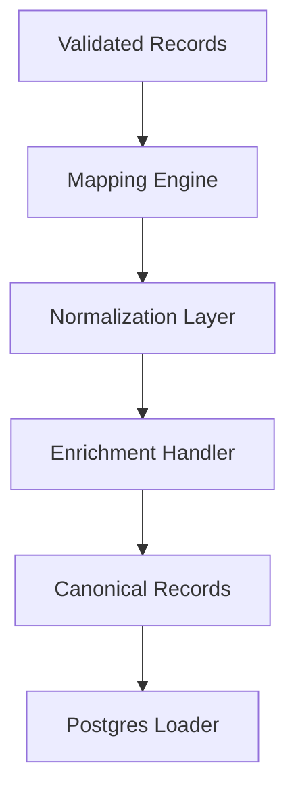

# SPEC-008: Data Transformation

## 1. Specification Overview

### Spec ID
SPEC-008

### Module Name
Data Transformation

### Purpose
Convert validated records from heterogeneous sources into a unified canonical representation ready for loading into PostgreSQL.

### Description
This module defines the transformation layer that maps input records from CSV, REST API, and MongoDB sources into a common schema. It ensures consistency in field naming, type normalization, and enrichment required for downstream storage and analysis.

### Business Goal
Provide a single logical representation of all ingested data so that downstream loading and reporting logic remain consistent.

### Scope
- Source-to-target mapping
- Canonical schema transformation
- Field normalization
- Deduplication and enrichment preparation

### Out of Scope
- Database persistence logic
- Business intelligence reporting

### Priority
High

### Estimated Complexity
Medium to High

---

## 2. Objectives
- Standardize records from all sources into one canonical format.
- Preserve business meaning while normalizing naming and data types.
- Prepare transformed data for PostgreSQL loading.

---

## 3. Functional Requirements
1. FR-001: The module shall accept validated records from the validation layer.
2. FR-002: The module shall map source-specific fields into a canonical schema.
3. FR-003: The module shall normalize field names, types, and values to a consistent format.
4. FR-004: The module shall support source-specific transformation rules.
5. FR-005: The module shall produce a transformation result object for each record.
6. FR-006: The module shall preserve traceability metadata such as source and validation status.
7. FR-007: The module shall flag or exclude records that cannot be transformed safely.

---

## 4. Non Functional Requirements
### Performance
- Transformation should scale with record volume and remain efficient in batch runs.

### Reliability
- Transformation should be deterministic and repeatable.

### Maintainability
- Mapping rules should be explicit and documented.

### Scalability
- New sources and fields should be added without redesign.

### Security
- Transformation must avoid exposing sensitive values in logs.

### Logging
- Transformation outcomes should be logged with record and source context.

### Error Handling
- Transform failures should be isolated per record where possible.

### Configuration
- Transformation rules should be configurable.

### Testing
- Transformation logic shall be covered by unit and integration tests.

---

## 5. Module Responsibilities
- Receive validated records.
- Apply canonical mapping logic.
- Normalize values and fields.
- Return transformed records for loading.

---

## 6. Inputs
- Validated records from the validation module.
- Mapping rules and configuration values.
- Source metadata.

---

## 7. Outputs
- Canonical transformed records.
- Transformation errors and rejected records.
- Summary statistics.

---

## 8. Internal Components
### Mapping Engine
Purpose: Map source fields into canonical fields.

Responsibilities:
- Define field mapping rules.
- Apply transformations per field.

### Normalization Layer
Purpose: Standardize data types and values.

Responsibilities:
- Normalize dates, strings, booleans, and numeric values.

### Enrichment Handler
Purpose: Add required processing metadata.

Responsibilities:
- Attach source, batch, and timestamp data.

---

## 9. File Structure
- etl/transformers/transformer.py — main transformation workflow.
- etl/transformers/mappers.py — mapping logic.
- tests/unit/transformers/test_transformer.py — unit tests.

---

## 10. Public Interfaces
### DataTransformer
Purpose: Transform validated records into a canonical model.
Parameters: records, source type, configuration.
Return Value: transformed records and summary.
Exceptions: TransformationError.

---

## 11. Data Flow

---

## 12. Error Handling Strategy
- Records that fail transformation should be marked and reported.
- Partial processing should continue where possible.

---

## 13. Configuration
### Environment Variables
- TRANSFORMATION_STRICT_MODE
- CANONICAL_SCHEMA_VERSION

---

## 14. Logging Strategy
- Log transformation start, per-record success, and transformation failure events.

---

## 15. Testing Strategy
- Unit tests for mapping and normalization rules.
- Integration tests with representative records from each source.

---

## 16. Dependencies
- Validation module outputs.
- Configuration module.

---

## 17. Risks
- Ambiguous field mappings.
- Source-specific semantic differences.

---

## 18. Sprint Breakdown
### Sprint 1
Goal: Define canonical model and mapping rules.
Tasks: Define transformation contract and field mapping strategy.
Deliverables: Transformation design and baseline logic.
Exit Criteria: Sample records can be transformed into a canonical shape.

---

## 19. Daily Development Plan
### Day 1
Objectives: Define canonical schema.
Tasks: Review source record models and map shared fields.
Expected Deliverables: Canonical schema draft.
Files Expected: etl/transformers/transformer.py.
Acceptance Criteria: Common transformation target is agreed.

---

## 20. Acceptance Criteria
- [ ] Records from all sources can be transformed into the same canonical format.
- [ ] Transformation outputs are consistent and load-ready.
- [ ] Invalid or untransformable records are flagged.

---

## 21. Future Enhancements
- Add rule-driven transformation configuration.
- Add lineage and provenance metadata.
