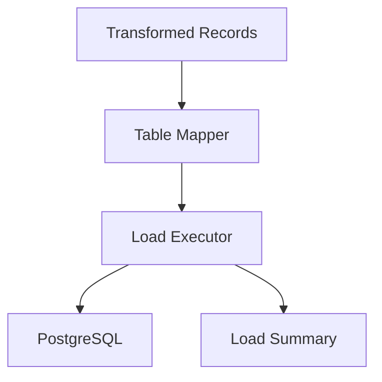

# SPEC-009: PostgreSQL Loader

## 1. Specification Overview

### Spec ID
SPEC-009

### Module Name
PostgreSQL Loader

### Purpose
Persist transformed records into PostgreSQL using a controlled and auditable loading process.

### Description
This module writes canonical ETL records into PostgreSQL, manages insert/update behavior, handles transactional boundaries, and reports load outcomes for downstream workflows.

### Business Goal
Ensure validated and transformed data is safely persisted in a relational data store for downstream use.

### Scope
- Database connection handling
- Record insertion and update logic
- Transaction management
- Load result reporting

### Out of Scope
- Data warehouse design beyond the ETL target tables
- Advanced analytics processing

### Priority
High

### Estimated Complexity
Medium

---

## 2. Objectives
- Write transformed records to PostgreSQL reliably.
- Maintain data integrity and clear load outcomes.
- Support repeatable loads and error reporting.

---

## 3. Functional Requirements
1. FR-001: The module shall connect to PostgreSQL using configured credentials.
2. FR-002: The module shall write transformed records into the target database tables.
3. FR-003: The module shall support insert and update strategies for repeated loads.
4. FR-004: The module shall report the number of successful and failed record writes.
5. FR-005: The module shall handle database errors without corrupting unrelated data.
6. FR-006: The module shall preserve source provenance metadata in the target records where applicable.
7. FR-007: The module shall provide a clear load summary for Airflow and operators.

---

## 4. Non Functional Requirements
### Performance
- Load throughput should be acceptable for expected batch sizes.

### Reliability
- Database operations should be transaction-safe.

### Maintainability
- Load logic should be modular and straightforward to extend.

### Scalability
- The design should support future table growth and additional data types.

### Security
- Database credentials must be protected and not logged in plaintext.

### Logging
- Load start, success, and failure events must be logged.

### Error Handling
- Load failures should be isolated and traceable.

### Configuration
- Connection and table mapping should be configurable.

### Testing
- Unit and integration tests shall cover successful loads and failure scenarios.

---

## 5. Module Responsibilities
- Establish the database connection.
- Map transformed records to target tables.
- Write records to PostgreSQL.
- Report load status.

---

## 6. Inputs
- Transformed records.
- Target table mappings.
- Connection configuration.

---

## 7. Outputs
- Persisted rows in PostgreSQL.
- Load summary metrics.
- Failure details for rejected rows.

---

## 8. Internal Components
### Connection Manager
Purpose: Create and maintain PostgreSQL connections.

Responsibilities:
- Manage sessions and transactions.

### Table Mapper
Purpose: Map canonical records to table schema.

Responsibilities:
- Define target table mappings.

### Load Executor
Purpose: Write records to the database.

Responsibilities:
- Execute insert/update operations.

---

## 9. File Structure
- etl/loaders/postgres_loader.py — main loader workflow.
- tests/unit/loaders/test_postgres_loader.py — unit tests.

---

## 10. Public Interfaces
### PostgresLoader
Purpose: Load transformed records into PostgreSQL.
Parameters: records, target configuration.
Return Value: load summary with counts and errors.
Exceptions: DatabaseConnectionError, LoadExecutionError.

---

## 11. Data Flow

---

## 12. Error Handling Strategy
- Failed writes should be isolated and summarized.
- Transaction rollback should occur for failed batch operations where appropriate.

---

## 13. Configuration
### Environment Variables
- POSTGRES_HOST
- POSTGRES_PORT
- POSTGRES_DB
- POSTGRES_USER
- POSTGRES_PASSWORD

---

## 14. Logging Strategy
- Log connection status, load start, row counts, and failure details.

---

## 15. Testing Strategy
- Unit tests for mapping and execution logic.
- Integration tests using a test PostgreSQL instance.

---

## 16. Dependencies
- SQLAlchemy or psycopg2
- PostgreSQL instance

---

## 17. Risks
- Database connectivity issues.
- Schema mismatches between transformed records and target tables.

---

## 18. Sprint Breakdown
### Sprint 1
Goal: Implement loader foundation.
Tasks: Connect to PostgreSQL and define table mappings.
Deliverables: Baseline loader workflow.
Exit Criteria: Sample records can be written successfully.

---

## 19. Daily Development Plan
### Day 1
Objectives: Define target schema contract.
Tasks: Review canonical record shape and target table design.
Expected Deliverables: Table mapping plan.
Files Expected: etl/loaders/postgres_loader.py.
Acceptance Criteria: Target columns are clearly defined.

---

## 20. Acceptance Criteria
- [ ] PostgreSQL connections are established.
- [ ] Transformed records are written successfully.
- [ ] Load outcomes are reported clearly.

---

## 21. Future Enhancements
- Add batch size tuning and bulk load optimization.
- Support incremental update strategies.
