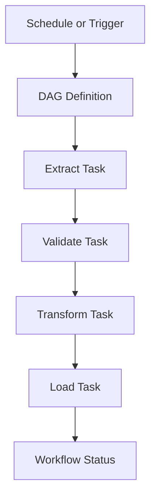

# SPEC-010: Airflow DAG Orchestration

## 1. Specification Overview

### Spec ID
SPEC-010

### Module Name
Airflow DAG Orchestration

### Purpose
Coordinate the ETL workflow using Apache Airflow so extraction, validation, transformation, and loading operate in a controlled sequence.

### Description
This module defines the orchestration responsibilities for the ETL pipeline, including task sequencing, scheduling, retry handling, state tracking, and operational visibility.

### Business Goal
Provide a reliable, observable, and repeatable workflow execution model for the ETL process.

### Scope
- Workflow orchestration
- Task dependencies
- Scheduling and retries
- Operational monitoring hooks

### Out of Scope
- Detailed Airflow deployment configuration
- Custom UI development

### Priority
High

### Estimated Complexity
High

---

## 2. Objectives
- Orchestrate ETL tasks in a dependable order.
- Support manual and scheduled execution.
- Provide error handling, retries, and workflow observability.

---

## 3. Functional Requirements
1. FR-001: The module shall define a workflow that runs extract, validate, transform, and load tasks in sequence.
2. FR-002: The module shall support task dependencies and controlled execution order.
3. FR-003: The module shall support retries and failure handling for task-level issues.
4. FR-004: The module shall surface workflow state and task status for operators.
5. FR-005: The module shall allow configuration of scheduling cadence and execution parameters.
6. FR-006: The module shall provide operational hooks for logs and downstream monitoring.
7. FR-007: The module shall support manual execution triggers in addition to scheduled runs.

---

## 4. Non Functional Requirements
### Performance
- Workflow startup overhead should remain low.

### Reliability
- Task failures should be visible and recoverable.

### Maintainability
- DAG structure must be clear and modular.

### Scalability
- The orchestration design should support additional tasks and workflows.

### Security
- Credentials and secrets must not be embedded in workflow definitions.

### Logging
- Workflow events and task outcomes must be logged.

### Error Handling
- Failed tasks should produce actionable retry and alert behavior.

### Configuration
- Scheduling and runtime settings must be configurable.

### Testing
- Workflow behavior should be covered through static validation and integration tests where feasible.

---

## 5. Module Responsibilities
- Define ETL workflow sequence.
- Manage task dependencies.
- Coordinate retries and failure handling.
- Expose workflow state to operators.

---

## 6. Inputs
- ETL task definitions.
- Source configuration.
- Runtime settings and environment variables.

---

## 7. Outputs
- Workflow execution state.
- Task-level status data.
- Logs and execution metadata.

---

## 8. Internal Components
### DAG Definition
Purpose: Describe workflow structure and dependencies.

Responsibilities:
- Sequence tasks and define triggers.

### Task Handler
Purpose: Represent each ETL step as an execution unit.

Responsibilities:
- Wrap each stage with Airflow-compatible task behavior.

### Retry Manager
Purpose: Control retries and failure behavior.

Responsibilities:
- Configure retry counts and delays.

---

## 9. File Structure
- airflow/dags/ — DAG definitions.
- airflow/plugins/ — reusable workflow plugins or helpers.
- airflow/logs/ — execution logs and local artifacts.

---

## 10. Public Interfaces
### ETLWorkflow
Purpose: Define and orchestrate the ETL pipeline.
Parameters: workflow settings, task definitions.
Return Value: workflow execution state.
Exceptions: WorkflowConfigurationError.

---

## 11. Data Flow

---

## 12. Error Handling Strategy
- Failed tasks should be retried according to policy.
- Task failures should emit detailed logs and meaningful error status.

---

## 13. Configuration
### Environment Variables
- AIRFLOW__CORE__EXECUTOR
- AIRFLOW__CORE__LOAD_EXAMPLES

---

## 14. Logging Strategy
- Log DAG start, task state changes, retries, and completion.

---

## 15. Testing Strategy
- Static validation of DAG structure.
- Integration tests for task dependency behavior.

---

## 16. Dependencies
- Apache Airflow
- ETL modules

---

## 17. Risks
- Workflow complexity and maintenance overhead.
- Dependency failures causing full-pipeline disruption.

---

## 18. Sprint Breakdown
### Sprint 1
Goal: Define orchestration workflow structure.
Tasks: Map ETL stages and dependencies.
Deliverables: Workflow design and task contract.
Exit Criteria: Task sequence is agreed and documented.

---

## 19. Daily Development Plan
### Day 1
Objectives: Define workflow stages.
Tasks: Identify responsibilities for each ETL stage.
Expected Deliverables: DAG structure draft.
Files Expected: airflow/dags/.
Acceptance Criteria: Task flow is clear and ordered.

---

## 20. Acceptance Criteria
- [ ] ETL stages run in the correct order.
- [ ] Retries and failures are handled.
- [ ] Workflow state is observable.

---

## 21. Future Enhancements
- Add SLA-based alerting and branching logic.
- Introduce dynamic task generation for new sources.
