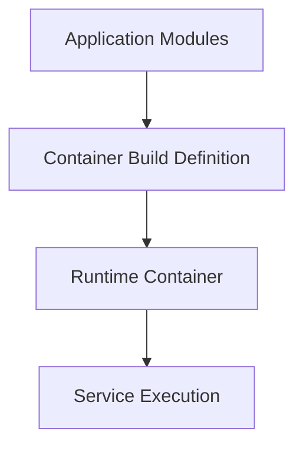

# SPEC-011: Docker Packaging

## 1. Specification Overview

### Spec ID
SPEC-011

### Module Name
Docker Packaging

### Purpose
Define the containerization strategy for the ETL application and its runtime dependencies.

### Description
This module specifies how the ETL application services are packaged as containers so they can run consistently across local, staging, and deployment environments.

### Business Goal
Provide an environment-independent packaging approach that simplifies setup and deployment.

### Scope
- Container design
- Runtime packaging
- Environment isolation

### Out of Scope
- Cloud-specific deployment logic

### Priority
Medium

### Estimated Complexity
Medium

---

## 2. Objectives
- Package the application into deployable container images.
- Ensure services run with consistent runtime dependencies.
- Support local development as well as containerized execution.

---

## 3. Functional Requirements
1. FR-001: The module shall define container packaging requirements for the ETL application components.
2. FR-002: The module shall isolate runtime dependencies for each service where appropriate.
3. FR-003: The module shall support environment variables and configuration injection.
4. FR-004: The module shall ensure container images are suitable for reproducible deployment.
5. FR-005: The module shall define service startup expectations and health readiness behavior.

---

## 4. Non Functional Requirements
### Performance
- Containers should start promptly and use reasonable resources.

### Reliability
- Container setup should support predictable startup and shutdown behavior.

### Maintainability
- Image definitions should be clearly organized and documented.

### Security
- Images should avoid unnecessary packages and embedded secrets.

### Logging
- Container logs should be accessible and structured where possible.

### Error Handling
- Startup failures should be visible and debuggable.

### Configuration
- Runtime values should be passed through environment configuration.

### Testing
- Container build and startup behavior should be validated.

---

## 5. Module Responsibilities
- Define container packaging boundaries.
- Standardize runtime environment expectations.
- Support deployment readiness.

---

## 6. Inputs
- Application modules.
- Runtime dependencies.
- Environment configuration.

---

## 7. Outputs
- Container definitions and runtime packaging expectations.
- Build and startup guidance.

---

## 8. Internal Components
### Image Definition
Purpose: Describe the runtime packaging model.

Responsibilities:
- Define base image, dependencies, and startup command.

### Service Runtime Contract
Purpose: Document service execution and health expectations.

Responsibilities:
- Define environment values and startup behavior.

---

## 9. File Structure
- docker/images/ — container packaging assets.
- docker/compose/ — orchestration configuration assets.

---

## 10. Public Interfaces
No runtime programming interface is required. This module supplies deployment packaging design and runtime expectations.

---

## 11. Data Flow

---

## 12. Error Handling Strategy
- Startup failures should be logged and surfaced clearly.
- Missing runtime configuration should prevent service boot where appropriate.

---

## 13. Configuration
### Environment Variables
- POSTGRES_DB
- POSTGRES_USER
- POSTGRES_PASSWORD
- MONGO_URI

---

## 14. Logging Strategy
- Container logs must capture startup, execution, and error events.

---

## 15. Testing Strategy
- Validate container build and basic start-up conditions.
- Confirm service dependencies can come up in expected order.

---

## 16. Dependencies
- Docker
- Runtime dependencies from requirements.

---

## 17. Risks
- Container image bloat.
- Environment drift between host and container.

---

## 18. Sprint Breakdown
### Sprint 1
Goal: Define container packaging model.
Tasks: Define service boundaries and runtime dependencies.
Deliverables: Container strategy document.
Exit Criteria: Packaging approach is accepted.

---

## 19. Daily Development Plan
### Day 1
Objectives: Define runtime packaging needs.
Tasks: Review dependencies and service separation.
Expected Deliverables: Packaging plan.
Files Expected: docker/images/.
Acceptance Criteria: Packaging scope is understood.

---

## 20. Acceptance Criteria
- [ ] Container runtime model is defined.
- [ ] Services can be packaged consistently.
- [ ] Environment configuration is supported.

---

## 21. Future Enhancements
- Add image optimization and multi-stage builds.
- Introduce auto-restart and health-check policies.
