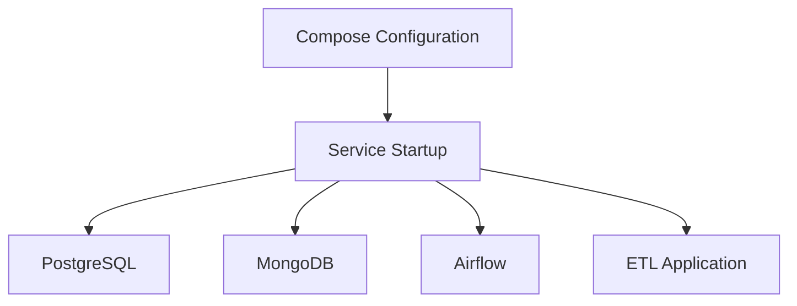

# SPEC-012: Docker Compose

## 1. Specification Overview

### Spec ID
SPEC-012

### Module Name
Docker Compose

### Purpose
Define how the ETL services, data stores, and orchestration components are composed and started together.

### Description
This module defines the multi-service deployment model for local or shared development environments. It covers service dependencies, networking, volumes, and startup order.

### Business Goal
Make the entire ETL stack easy to run in a consistent local environment.

### Scope
- Multi-service composition
- Service dependencies
- Local environment startup
- Volume and networking assumptions

### Out of Scope
- Production orchestration beyond local/shared environment composition

### Priority
Medium

### Estimated Complexity
Medium

---

## 2. Objectives
- Define a single command path to start the system locally.
- Coordinate services such as PostgreSQL, MongoDB, Airflow, and the ETL application.
- Support predictable startup sequencing and shared networking.

---

## 3. Functional Requirements
1. FR-001: The module shall define service composition for all required runtime components.
2. FR-002: The module shall specify service dependencies and startup ordering.
3. FR-003: The module shall define shared networks and service discovery rules.
4. FR-004: The module shall define persistent storage expectations for PostgreSQL and MongoDB.
5. FR-005: The module shall support environment variable injection for runtime services.
6. FR-006: The module shall provide a consistent local development startup experience.

---

## 4. Non Functional Requirements
### Performance
- Startup should remain reasonably fast for local development.

### Reliability
- Services should start in a deterministic order.

### Maintainability
- Service definitions should remain readable and modular.

### Security
- Sensitive values should be supplied through environment configuration rather than embedded in definitions.

### Logging
- Shared logs should be accessible for troubleshooting.

### Error Handling
- Startup failures should be visible and actionable.

### Configuration
- Compose settings should be easy to override.

### Testing
- Compose startup should be validated in a controlled environment.

---

## 5. Module Responsibilities
- Compose the local runtime stack.
- Coordinate service dependencies.
- Expose configuration and networking assumptions.

---

## 6. Inputs
- Service definitions.
- Environment variables.
- Persistent storage requirements.

---

## 7. Outputs
- Local runtime environment.
- Service dependency and networking model.

---

## 8. Internal Components
### Service Definition
Purpose: Define each runtime service and its configuration.

Responsibilities:
- Specify image, environment, and volumes.

### Dependency Resolver
Purpose: Establish service startup ordering.

Responsibilities:
- Define health and dependency rules.

---

## 9. File Structure
- docker/compose/ — Compose configuration assets.

---

## 10. Public Interfaces
No code interface is required. The module provides orchestration assets for runtime startup.

---

## 11. Data Flow

---

## 12. Error Handling Strategy
- Startup failures should be surfaced through service logs.
- Missing dependencies should prevent service startup where necessary.

---

## 13. Configuration
### Environment Variables
- POSTGRES_DB
- POSTGRES_USER
- POSTGRES_PASSWORD
- MONGO_URI

---

## 14. Logging Strategy
- Service logs should be accessible for each container.

---

## 15. Testing Strategy
- Validate service startup and dependency readiness.

---

## 16. Dependencies
- Docker Compose
- Containerized services

---

## 17. Risks
- Service startup race conditions.
- Shared networking or volume issues.

---

## 18. Sprint Breakdown
### Sprint 1
Goal: Define local runtime composition.
Tasks: Define service list and dependencies.
Deliverables: Compose configuration baseline.
Exit Criteria: All services can be started together.

---

## 19. Daily Development Plan
### Day 1
Objectives: Define runtime topology.
Tasks: List services and dependency relationships.
Expected Deliverables: Compose design summary.
Files Expected: docker/compose/.
Acceptance Criteria: Runtime structure is documented.

---

## 20. Acceptance Criteria
- [ ] Services can be composed into a single runtime environment.
- [ ] Dependencies start in a sensible order.
- [ ] Shared environment variables are supported.

---

## 21. Future Enhancements
- Add environment-specific compose overlays.
- Support automated health checks and monitoring.
