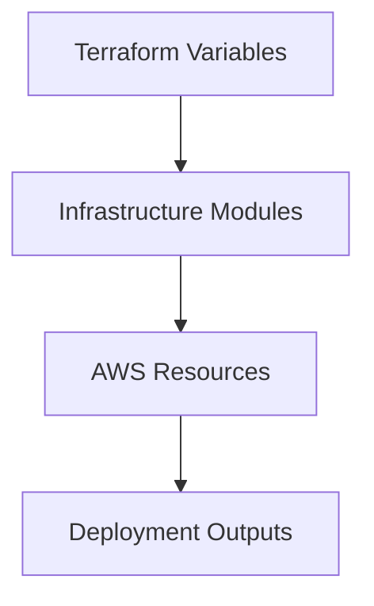

# SPEC-013: Terraform Infrastructure

## 1. Specification Overview

### Spec ID
SPEC-013

### Module Name
Terraform Infrastructure

### Purpose
Provision and manage the AWS EC2-based infrastructure required to host the ETL system.

### Description
This module defines the infrastructure-as-code approach for deploying the solution onto AWS EC2, including networking, security, compute, and environment-specific deployment assumptions.

### Business Goal
Enable repeatable, auditable infrastructure provisioning for the ETL platform.

### Scope
- Terraform project structure
- AWS EC2 provisioning
- Networking and security definitions
- Environment support

### Out of Scope
- Multi-region deployment strategy
- Advanced enterprise networking features

### Priority
High

### Estimated Complexity
High

---

## 2. Objectives
- Provision the target infrastructure with Terraform.
- Ensure infrastructure is repeatable and documented.
- Support deployment to AWS EC2 in a controlled way.

---

## 3. Functional Requirements
1. FR-001: The module shall define the infrastructure resources required for the ETL deployment.
2. FR-002: The module shall provision AWS EC2 compute resources for hosting the solution.
3. FR-003: The module shall define networking and security group requirements.
4. FR-004: The module shall support environment-specific variables for development and production.
5. FR-005: The module shall provide infrastructure outputs required for deployment and operations.

---

## 4. Non Functional Requirements
### Performance
- Provisioning should be efficient and deterministic.

### Reliability
- Infrastructure should be created in a repeatable state.

### Maintainability
- Terraform structure should be modular and documented.

### Scalability
- The design should support future resource growth.

### Security
- Security groups and access controls must follow least privilege.

### Logging
- Provisioning operations should be observable through Terraform output and logs.

### Error Handling
- Failed provisioning should be surfaced clearly with remediation context.

### Configuration
- Terraform variables must be documented and environment-driven.

### Testing
- Terraform plans should be validated before deployment.

---

## 5. Module Responsibilities
- Define infrastructure components.
- Provision EC2 and supporting resources.
- Manage environment-specific deployment settings.

---

## 6. Inputs
- AWS account and region details.
- Instance sizing and networking requirements.
- Environment variables and Terraform variables.

---

## 7. Outputs
- Provisioned EC2 resources.
- Network and security configuration.
- Deployment outputs for application installation and configuration.

---

## 8. Internal Components
### Network Module
Purpose: Define VPC, subnets, and security groups.

Responsibilities:
- Provision networking components.

### Compute Module
Purpose: Define EC2 instance resources.

Responsibilities:
- Provision compute resources and access controls.

### Environment Module
Purpose: Parameterize deployment settings by environment.

Responsibilities:
- Provide environment-specific input values.

---

## 9. File Structure
- terraform/modules/ — reusable Terraform modules.
- terraform/environments/ — environment-specific definitions.
- terraform/scripts/ — provisioning and utility scripts.

---

## 10. Public Interfaces
No application interface is required. This module exposes Terraform inputs, outputs, and resource definitions.

---

## 11. Data Flow

---

## 12. Error Handling Strategy
- Provisioning failures must stop the deployment and provide targeted error context.
- Terraform state must be preserved and reviewed before changes are applied.

---

## 13. Configuration
### Environment Variables
- AWS_REGION
- AWS_PROFILE
- TF_VAR_instance_type
- TF_VAR_environment

---

## 14. Logging Strategy
- Terraform plan and apply output should be stored and reviewed.

---

## 15. Testing Strategy
- Validate Terraform syntax and plan output.
- Review state changes before applying.

---

## 16. Dependencies
- Terraform CLI
- AWS provider
- EC2-compatible environment

---

## 17. Risks
- Misconfigured networking or security rules.
- Infrastructure drift.

---

## 18. Sprint Breakdown
### Sprint 1
Goal: Define infrastructure scope.
Tasks: Review resource requirements and environment targets.
Deliverables: Terraform architecture baseline.
Exit Criteria: The infrastructure plan is approved.

---

## 19. Daily Development Plan
### Day 1
Objectives: Define required AWS resources.
Tasks: Review compute, networking, and security needs.
Expected Deliverables: Terraform resource plan.
Files Expected: terraform/modules/.
Acceptance Criteria: Resource boundaries are clear.

---

## 20. Acceptance Criteria
- [ ] Terraform provisions the defined AWS infrastructure.
- [ ] Network and security requirements are represented.
- [ ] Environment-specific values are supported.

---

## 21. Future Enhancements
- Add autoscaling and load balancing.
- Support multiple environments with shared modules.
