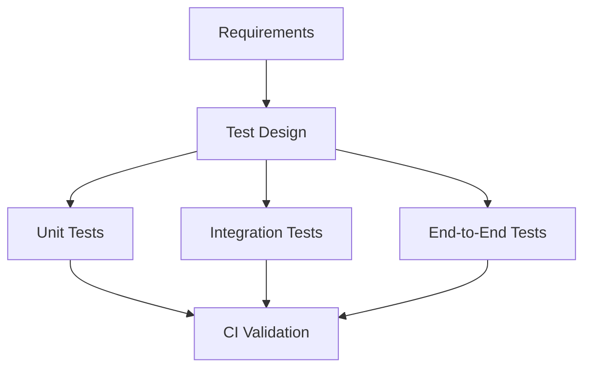

# SPEC-014: Testing Strategy

## 1. Specification Overview

### Spec ID
SPEC-014

### Module Name
Testing Strategy

### Purpose
Define the testing approach for the ETL platform across unit, integration, and end-to-end scenarios.

### Description
This module specifies the test architecture, coverage goals, and validation expectations for the extraction, validation, transformation, loading, and orchestration layers.

### Business Goal
Ensure that the system is reliable, maintainable, and regression-resistant as it evolves.

### Scope
- Unit tests
- Integration tests
- End-to-end validation strategy
- Coverage expectations

### Out of Scope
- Manual exploratory testing beyond documented scenarios

### Priority
High

### Estimated Complexity
Medium

---

## 2. Objectives
- Provide automated coverage for core ETL behaviors.
- Catch regressions early in the development lifecycle.
- Validate end-to-end workflow behavior.

---

## 3. Functional Requirements
1. FR-001: The project shall define a test framework and test organization strategy.
2. FR-002: Unit tests shall cover individual module logic and edge cases.
3. FR-003: Integration tests shall validate cross-module behavior.
4. FR-004: The strategy shall define acceptable test data and fixtures.
5. FR-005: The test suite shall support CI execution.
6. FR-006: The strategy shall include failure and regression scenarios.

---

## 4. Non Functional Requirements
### Performance
- Tests should complete timely and avoid excessive runtime.

### Reliability
- Tests must be deterministic and stable.

### Maintainability
- Tests must be organized by module and concern.

### Scalability
- Additional modules should be easy to test.

### Security
- Test data must not contain real secrets.

### Logging
- Test failures should include clear diagnostics.

### Error Handling
- Tests should verify expected failures and exceptions.

### Configuration
- Test environments should be configurable separately from production.

### Testing
- Automated tests are the primary quality gate.

---

## 5. Module Responsibilities
- Define test structure and standards.
- Coordinate test execution by layer.
- Ensure regression coverage.

---

## 6. Inputs
- Requirements and specifications.
- Module interfaces.
- Test fixtures and sample datasets.

---

## 7. Outputs
- Test suite artifacts.
- Coverage reports.
- Failure diagnostics.

---

## 8. Internal Components
### Unit Test Layer
Purpose: Validate individual module behavior.

Responsibilities:
- Test pure logic and minimal components.

### Integration Test Layer
Purpose: Validate interactions between modules.

Responsibilities:
- Test end-to-end behavior within the ETL pipeline.

### Regression Test Layer
Purpose: Protect against known defects returning.

Responsibilities:
- Re-run previously failing scenarios.

---

## 9. File Structure
- tests/unit/ — unit test suites.
- tests/integration/ — integration tests.
- tests/e2e/ — end-to-end tests.

---

## 10. Public Interfaces
No runtime interface is required. This module defines testing standards and expectations.

---

## 11. Data Flow

---

## 12. Error Handling Strategy
- Test failures should clearly identify the affected module and scenario.
- Flaky tests should be remedied rather than suppressed.

---

## 13. Configuration
### Environment Variables
- PYTEST_ADDOPTS
- TEST_DATA_PATH

---

## 14. Logging Strategy
- Log test setup, execution status, and failure context.

---

## 15. Testing Strategy
- Unit tests for each module.
- Integration tests for ETL pipeline handoffs.
- End-to-end tests for complete workflow success and failure cases.

---

## 16. Dependencies
- pytest
- Test fixtures and sample data

---

## 17. Risks
- Insufficient test coverage.
- Flaky or environment-dependent tests.

---

## 18. Sprint Breakdown
### Sprint 1
Goal: Establish test harness.
Tasks: Define test organization and base fixtures.
Deliverables: Test directory structure and baseline test patterns.
Exit Criteria: Initial tests are runnable.

---

## 19. Daily Development Plan
### Day 1
Objectives: Define testing scope.
Tasks: Review module boundaries and expected behaviors.
Expected Deliverables: Test plan.
Files Expected: tests/.
Acceptance Criteria: Test coverage priorities are agreed.

---

## 20. Acceptance Criteria
- [ ] Core modules have automated tests.
- [ ] Integration scenarios are covered.
- [ ] CI execution is supported.

---

## 21. Future Enhancements
- Add performance and resilience regression tests.
- Introduce mutation testing.
