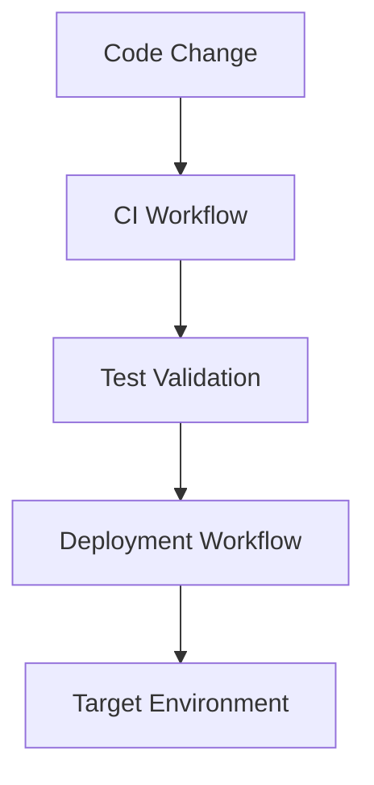

# SPEC-015: GitHub Actions CI/CD

## 1. Specification Overview

### Spec ID
SPEC-015

### Module Name
GitHub Actions CI/CD

### Purpose
Automate validation, testing, and deployment workflows for the ETL project using GitHub Actions.

### Description
This module defines the CI/CD pipeline structure for building, testing, packaging, and deploying the solution in a controlled and repeatable manner.

### Business Goal
Reduce manual deployment effort and ensure changes are validated before reaching target environments.

### Scope
- CI workflow automation
- Test execution automation
- Deployment workflow automation
- Environment promotion controls

### Out of Scope
- Full release management beyond CI/CD basics

### Priority
High

### Estimated Complexity
Medium

---

## 2. Objectives
- Automate test execution for every change.
- Provide deployment automation for approved changes.
- Make CI/CD behavior consistent and auditable.

---

## 3. Functional Requirements
1. FR-001: The module shall define a CI workflow for linting, testing, and validation.
2. FR-002: The module shall run the test suite automatically on pull requests and mainline changes.
3. FR-003: The module shall support deployment workflows for approved environments.
4. FR-004: The module shall use environment-specific secrets and configuration securely.
5. FR-005: The module shall allow deployment gating based on successful validation steps.

---

## 4. Non Functional Requirements
### Performance
- Pipelines should complete promptly for standard changes.

### Reliability
- Workflows must fail clearly on broken or insecure conditions.

### Maintainability
- Workflow definitions should remain simple and readable.

### Security
- Secrets must be managed through GitHub environment configuration.

### Logging
- Workflow logs should be accessible and reviewable.

### Error Handling
- Failed workflows should provide actionable diagnostics.

### Configuration
- Reusable variables and environment mappings should be documented.

### Testing
- CI/CD behavior should be validated through dry runs and controlled test workflows.

---

## 5. Module Responsibilities
- Define CI and deployment workflows.
- Enforce automation gates.
- Support environment-safe deployments.

---

## 6. Inputs
- Repository changes.
- Test results.
- Deployment targets and secrets.

---

## 7. Outputs
- Automated test and deployment results.
- Build artifacts where required.
- Deployment status summaries.

---

## 8. Internal Components
### CI Workflow
Purpose: Validate code changes before merge or deployment.

Responsibilities:
- Run tests and checks.

### Deployment Workflow
Purpose: Deliver approved changes to the target environment.

Responsibilities:
- Deploy artifacts and update environment configuration.

---

## 9. File Structure
- .github/workflows/ — GitHub Actions workflow definitions.

---

## 10. Public Interfaces
No runtime interface is required. This module provides CI/CD workflow definitions.

---

## 11. Data Flow

---

## 12. Error Handling Strategy
- Failed validations must block deployment.
- Deployment issues should be clearly reported to operators.

---

## 13. Configuration
### Environment Variables
- CI environment variables for tests and deployment targets.

---

## 14. Logging Strategy
- Workflow logs should capture step status, failures, and deployment output.

---

## 15. Testing Strategy
- Validate workflows using test branches and controlled environments.

---

## 16. Dependencies
- GitHub Actions
- Repository secrets and environments

---

## 17. Risks
- Pipeline instability.
- Secret misconfiguration or leakage.

---

## 18. Sprint Breakdown
### Sprint 1
Goal: Define CI/CD baseline.
Tasks: Define validation and deployment workflow requirements.
Deliverables: Initial workflow definitions.
Exit Criteria: Changes trigger automated validation.

---

## 19. Daily Development Plan
### Day 1
Objectives: Define automation requirements.
Tasks: Review environment promotion and validation needs.
Expected Deliverables: CI/CD workflow plan.
Files Expected: .github/workflows/.
Acceptance Criteria: Workflow triggers and gates are defined.

---

## 20. Acceptance Criteria
- [ ] CI automatically validates changes.
- [ ] Deployment is gated by successful validation.
- [ ] Secrets are handled securely.

---

## 21. Future Enhancements
- Add deployment approval gates and rollback support.
- Integrate with infrastructure deployment workflows.
