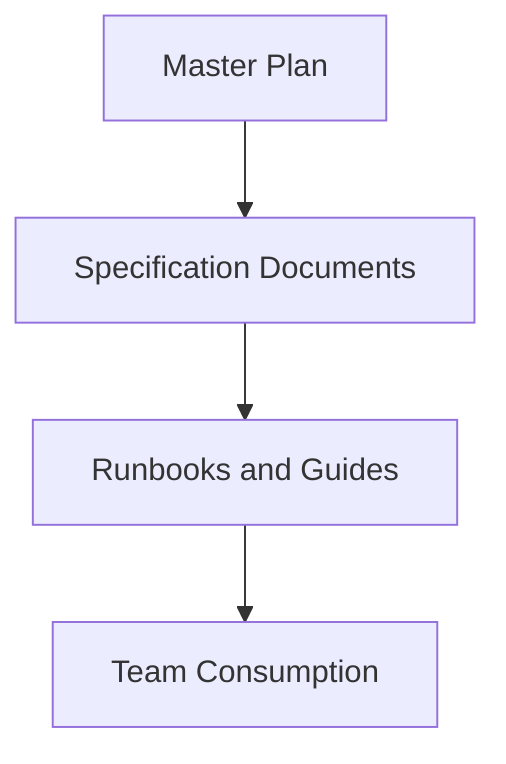

# SPEC-016: Documentation

## 1. Specification Overview

### Spec ID
SPEC-016

### Module Name
Documentation

### Purpose
Establish the documentation structure and maintenance approach for the ETL project.

### Description
This module defines how project documentation is organized, maintained, and shared across the engineering team. It ensures that architecture, operational, and implementation guidance remains accessible and current.

### Business Goal
Improve maintainability and reduce onboarding and support effort through clear, structured documentation.

### Scope
- Documentation structure
- Architecture and specification references
- Operational and onboarding content

### Out of Scope
- End-user product documentation

### Priority
Medium

### Estimated Complexity
Medium

---

## 2. Objectives
- Provide a clear documentation structure for the project.
- Ensure the master plan and specifications remain discoverable.
- Support onboarding, operations, and future implementation work.

---

## 3. Functional Requirements
1. FR-001: The project shall include a master planning document and supporting specification documents.
2. FR-002: Documentation shall be organized by purpose, such as architecture, specifications, and runbooks.
3. FR-003: Documentation shall describe operational steps relevant to deployment and maintenance.
4. FR-004: Documentation shall remain aligned with the current repository structure and scope.
5. FR-005: The project shall provide a README for onboarding and high-level project understanding.

---

## 4. Non Functional Requirements
### Performance
- Documentation should be lightweight and easy to navigate.

### Reliability
- Documents should reflect current project state and be updated as scope changes.

### Maintainability
- Documentation should follow a consistent template.

### Scalability
- New modules and phases should be easy to document.

### Security
- Documentation must not include secrets or sensitive deployment details.

### Logging
- Not applicable.

### Error Handling
- Documentation gaps should be tracked and resolved through review.

### Configuration
- No runtime configuration is required.

### Testing
- Documentation quality should be reviewed during handoff and release readiness.

---

## 5. Module Responsibilities
- Organize documentation assets.
- Maintain consistency with the master plan.
- Support onboarding and operations.

---

## 6. Inputs
- Master plan.
- Module specifications.
- Operational learnings and implementation outcomes.

---

## 7. Outputs
- Project documentation set.
- Onboarding guides and runbooks.
- Updated architectural references.

---

## 8. Internal Components
### Documentation Index
Purpose: Organize and connect documentation assets.

Responsibilities:
- Group documents by topic.

### Runbook Content
Purpose: Provide operational instructions.

Responsibilities:
- Record deployment and support processes.

---

## 9. File Structure
- docs/architecture/ — architecture documentation.
- docs/specs/ — technical specifications.
- docs/runbooks/ — operational guidance.
- README.md — high-level onboarding content.

---

## 10. Public Interfaces
No runtime interface is required. This module provides documentation assets.

---

## 11. Data Flow

---

## 12. Error Handling Strategy
- Missing documentation should be identified during review.
- Documentation drift should be corrected through periodic updates.

---

## 13. Configuration
No runtime configuration is required.

---

## 14. Logging Strategy
Not applicable.

---

## 15. Testing Strategy
- Review documentation completeness.
- Confirm links and references remain valid.

---

## 16. Dependencies
- Master plan and specification documents.

---

## 17. Risks
- Documentation drift.
- Outdated operational instructions.

---

## 18. Sprint Breakdown
### Sprint 1
Goal: Establish documentation structure.
Tasks: Create folders and baseline content.
Deliverables: Documentation set and onboarding materials.
Exit Criteria: Team can locate the relevant documents.

---

## 19. Daily Development Plan
### Day 1
Objectives: Define document set and organization.
Tasks: Review master plan and identify required documentation.
Expected Deliverables: Documentation map.
Files Expected: docs/.
Acceptance Criteria: Documentation structure is clear.

---

## 20. Acceptance Criteria
- [ ] Documentation is organized and discoverable.
- [ ] Master plan and specs are available.
- [ ] Operational guidance exists.

---

## 21. Future Enhancements
- Add searchable documentation indexes.
- Integrate docs with release and incident workflows.
