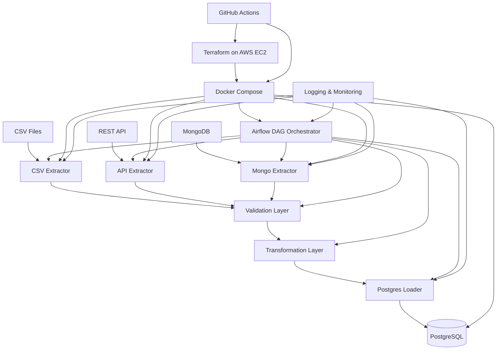

# MASTER PLAN
## Dockerized Multi-Source ETL Orchestrator

Document Version: 1.0
Date: 2026-06-29
Status: Draft for Approval
Owner: Engineering Leadership
Audience: Software Engineering Team, DevOps Team, QA Team, Product Stakeholders

---

## 1. Project Overview

### Purpose
The Dockerized Multi-Source ETL Orchestrator is a platform intended to ingest, validate, transform, and load data from multiple heterogeneous sources into a centralized PostgreSQL data repository. The solution will be containerized, orchestrated through Apache Airflow, deployed on AWS EC2 using Terraform, and supported by CI/CD automation through GitHub Actions.

### Goals
- Establish a reliable and repeatable ETL pipeline for CSV, REST API, and MongoDB sources.
- Standardize data ingestion and validation using a shared schema and business rules.
- Ensure traceability, observability, and auditability of all ETL operations.
- Provide a containerized deployment model suitable for development, staging, and production.
- Enable infrastructure provisioning and deployment automation on AWS.
- Deliver a maintainable architecture that supports future extensions.

### Business Problem
Organizations often rely on data distributed across multiple systems and formats. Manual extraction and integration efforts are expensive, error-prone, and difficult to scale. This project addresses the need for a consistent, automated ingestion workflow that can collect data from multiple sources, enforce quality rules, and make it available in a central relational store for analytics and downstream applications.

### Functional Requirements
- Extract data from:
  - CSV files
  - REST API endpoints
  - MongoDB collections
- Validate incoming records using Pydantic models.
- Transform source-specific records into a unified canonical format.
- Load validated and transformed records into PostgreSQL.
- Support scheduled and manual workflow execution through Apache Airflow.
- Maintain logs for extraction, validation, transformation, loading, and orchestration events.
- Provide a Docker-based deployment model for all services.
- Provision infrastructure on AWS EC2 using Terraform.
- Automate testing and deployment through GitHub Actions.

### Non Functional Requirements
- Reliability and fault tolerance for scheduled ETL jobs.
- Maintainability through modular architecture and clear documentation.
- Security for secrets, credentials, and access to external systems.
- Scalability to support increased data volume and additional sources.
- Observability through structured logging and operational monitoring.
- Portability through containerized deployment.
- Testability through automated unit and integration tests.

### Scope
In scope:
- Data extraction from the three specified sources
- Validation and transformation workflows
- PostgreSQL loading pipeline
- Airflow-based orchestration
- Docker Compose-based local deployment
- AWS EC2 provisioning with Terraform
- CI/CD pipeline using GitHub Actions
- Documentation and testing strategy

Out of scope:
- Advanced analytics dashboards
- Real-time streaming ingestion
- Multi-region cloud architecture
- Machine learning-based data quality detection

### Deliverables
- Master planning document
- Architecture documentation
- Technical specifications for each major system component
- Containerized deployment configuration
- Infrastructure as Code for AWS EC2 deployment
- CI/CD workflow definitions
- Test strategy and test suites
- Operational documentation and runbooks

---

## 2. High Level Architecture

### Overview
The system follows a layered ETL architecture. Each source is handled by a dedicated extractor module. Extracted data is passed through a validation layer that ensures conformance to expected structures and business rules. Validated data is transformed into a common schema and loaded into PostgreSQL. Apache Airflow orchestrates the execution order, scheduling, dependencies, retries, and monitoring of the ETL workflow.

### Components
- Data Source Connectors
  - CSV extractor
  - REST API extractor
  - MongoDB extractor
- Validation Layer
  - Pydantic-based schema validation and quality checks
- Transformation Layer
  - Canonical model mapping and normalization logic
- Loading Layer
  - PostgreSQL write operations and transactional handling
- Orchestration Layer
  - Apache Airflow DAGs and task orchestration
- Runtime Layer
  - Docker containers and Docker Compose services
- Infrastructure Layer
  - AWS EC2 provisioning and supporting infrastructure using Terraform
- Automation Layer
  - GitHub Actions for build, test, and deployment
- Observability Layer
  - Logging, monitoring, and alerting

### Data Sources
- CSV Files: static or periodic file-based datasets
- REST API: remote web services returning structured payloads
- MongoDB: document-based source collections

### Validation Layer
The validation layer ensures that incoming records conform to expected field types, required values, and business constraints. Validation errors should be captured with sufficient detail to support debugging and data quality tracking.

### Transformation Layer
The transformation layer converts all validated records into a unified internal representation. This standardization enables consistent loading and downstream use.

### Loading Layer
The loading layer writes validated and transformed records into PostgreSQL. Responsibilities include schema mapping, insert/update logic, error handling, and transaction safety.

### Airflow DAG
Airflow will manage workflow orchestration, track task status, schedule runs, and support retries and dependencies between ETL steps.

### PostgreSQL
PostgreSQL serves as the system of record for validated business data. It should support both storage and reporting use cases.

### Logging
Structured logging will be implemented across all modules to record processing status, warnings, and failures. Logs should be accessible for troubleshooting and operational review.

### Monitoring
Monitoring will cover container health, workflow execution status, task failures, data quality anomalies, and infrastructure health. Monitoring should allow proactive incident detection.

### Deployment
The application and supporting services will run inside Docker containers managed by Docker Compose. Infrastructure deployment to AWS EC2 will be managed through Terraform, while GitHub Actions will automate testing and deployment pipelines.

### Architecture Diagram



---

## 3. Folder Structure

The project should follow a modular and scalable folder layout to separate concerns and support future expansion.

```text
codebase/
├── .env
├── .gitignore
├── .github/
│   └── workflows/
├── airflow/
│   ├── dags/
│   ├── plugins/
│   └── logs/
├── config/
│   ├── env/
│   └── settings/
├── docker/
│   ├── compose/
│   └── images/
├── docs/
│   ├── architecture/
│   ├── specs/
│   └── runbooks/
├── etl/
│   ├── extractors/
│   ├── validators/
│   ├── transformers/
│   ├── loaders/
│   └── utils/
├── planning/
│   └── MASTER_PLAN.md
├── tests/
│   ├── unit/
│   ├── integration/
│   └── e2e/
├── terraform/
│   ├── modules/
│   ├── environments/
│   └── scripts/
├── README.md
├── requirements.txt
```

### Folder Explanations
- .env: Runtime environment variables for local and containerized execution.
- .gitignore: Excludes local environment, cache, and build artifacts from version control.
- .github/workflows/: GitHub Actions workflow definitions for CI/CD automation.
- airflow/: Contains Airflow orchestration assets, DAG definitions, related plugins, and execution logs.
- config/: Stores environment files, shared configuration settings, and runtime configuration.
- docker/: Contains Docker-related assets such as compose definitions and image build context.
- docs/: Houses architecture docs, specification documents, and operational runbooks.
- etl/: Main application package containing ingestion, validation, transformation, and load logic.
- etl/extractors/: Source-specific extraction modules.
- etl/validators/: Data validation and schema enforcement modules.
- etl/transformers/: Transformation logic to map source records to a canonical schema.
- etl/loaders/: Database loading components and persistence logic.
- etl/utils/: Shared helper functions and common utilities.
- planning/: Stores the project planning artifacts, including the master plan.
- tests/: Test suites for unit, integration, and end-to-end validation.
- terraform/: Infrastructure as Code for AWS EC2-based deployment.
- README.md: Project overview and initial onboarding information.
- requirements.txt: Project dependencies and runtime package requirements.

---

## 4. System Modules

### Module 1: Project Setup
- Purpose: Establish the initial project foundation and development conventions.
- Responsibilities: Repository initialization, environment planning, dependency strategy, documentation scaffolding, and baseline standards.
- Inputs: Project requirements, team standards, tooling assumptions.
- Outputs: Structured repository, initial documentation, baseline configuration.
- Dependencies: None.
- Estimated Complexity: Low.
- Possible Risks: Incomplete standards, unclear ownership, poorly scoped initial setup.

### Module 2: Configuration
- Purpose: Manage environment-specific settings and operational parameters.
- Responsibilities: Configuration loading, secret management strategy, environment separation, connection parameters, and defaults.
- Inputs: Environment requirements, service endpoints, credentials strategy.
- Outputs: Central configuration model and environment profiles.
- Dependencies: Project Setup.
- Estimated Complexity: Medium.
- Possible Risks: Misconfigured environments, insecure secret handling, inconsistent configuration between services.

### Module 3: Logging
- Purpose: Provide consistent logging across the platform.
- Responsibilities: Log formatting, log levels, context enrichment, error logging, and operational traceability.
- Inputs: Processing events, exceptions, workflow state changes.
- Outputs: Structured logs and diagnostic artifacts.
- Dependencies: Configuration.
- Estimated Complexity: Medium.
- Possible Risks: Poor log quality, inconsistent formats, excessive log volume.

### Module 4: CSV Extractor
- Purpose: Read and normalize data from CSV files.
- Responsibilities: Source file discovery, file parsing, schema inference, record extraction, and data staging.
- Inputs: CSV files and source metadata.
- Outputs: Extracted records ready for validation.
- Dependencies: Configuration, Logging.
- Estimated Complexity: Medium.
- Possible Risks: File format drift, encoding issues, missing data values.

### Module 5: API Extractor
- Purpose: Retrieve data from REST-based endpoints.
- Responsibilities: Request handling, authentication strategy, payload parsing, pagination handling, and error handling.
- Inputs: API endpoint definitions, credentials, request parameters.
- Outputs: Extracted JSON-derived records for validation.
- Dependencies: Configuration, Logging.
- Estimated Complexity: Medium.
- Possible Risks: API rate limits, unstable endpoints, authentication failures, inconsistent payload shapes.

### Module 6: Mongo Extractor
- Purpose: Retrieve data from MongoDB collections.
- Responsibilities: Connection management, query planning, document extraction, and record transformation to an intermediate format.
- Inputs: MongoDB connection settings and collection definitions.
- Outputs: Extracted document records ready for validation.
- Dependencies: Configuration, Logging.
- Estimated Complexity: Medium.
- Possible Risks: Schema variability, connection failures, query performance bottlenecks.

### Module 7: Validation
- Purpose: Enforce data quality rules before transformation and loading.
- Responsibilities: Schema validation, required field checks, type validation, business rule validation, and error reporting.
- Inputs: Raw extracted records.
- Outputs: Validated records and validation errors.
- Dependencies: Configuration, Logging.
- Estimated Complexity: Medium.
- Possible Risks: Incomplete rules, inconsistent validation behavior, false positives in data quality enforcement.

### Module 8: Transformation
- Purpose: Convert heterogeneous records into a unified canonical model.
- Responsibilities: Field mapping, normalization, enrichment, deduplication strategy, and output schema standardization.
- Inputs: Validated records from multiple sources.
- Outputs: Canonical records ready for database loading.
- Dependencies: Validation, Configuration.
- Estimated Complexity: Medium to High.
- Possible Risks: Semantic mismatches across sources, transformation regressions, mapping ambiguity.

### Module 9: Postgres Loader
- Purpose: Write canonical records into PostgreSQL.
- Responsibilities: Target table mapping, insert/update logic, transaction management, load error handling, and idempotency strategy.
- Inputs: Canonical transformed records.
- Outputs: Persisted data in PostgreSQL and load outcome status.
- Dependencies: Transformation, Configuration, Logging.
- Estimated Complexity: Medium.
- Possible Risks: Data integrity issues, load failures, duplicate inserts, schema mismatch.

### Module 10: Airflow DAG
- Purpose: Orchestrate ETL execution and operational workflow behavior.
- Responsibilities: Workflow scheduling, task sequencing, dependency management, retries, status tracking, and failure handling.
- Inputs: ETL tasks and execution rules.
- Outputs: Scheduled and monitored ETL runs.
- Dependencies: All ETL modules, Logging.
- Estimated Complexity: High.
- Possible Risks: Workflow complexity, dependency failures, poor observability.

### Module 11: Docker
- Purpose: Provide consistent runtime packaging for application services.
- Responsibilities: Container design, image strategy, environment packaging, runtime dependencies, and service isolation.
- Inputs: Application modules and runtime requirements.
- Outputs: Deployable container images.
- Dependencies: Project Setup, Configuration.
- Estimated Complexity: Medium.
- Possible Risks: Image bloat, environment drift, inconsistent runtime configuration.

### Module 12: Docker Compose
- Purpose: Coordinate local or shared service deployment.
- Responsibilities: Multi-service orchestration, network setup, service dependencies, volume management, and local environment startup.
- Inputs: Service definitions and runtime dependencies.
- Outputs: Consistent local runtime environment.
- Dependencies: Docker, Configuration.
- Estimated Complexity: Medium.
- Possible Risks: Environment mismatch, service startup ordering issues, persistent data handling problems.

### Module 13: Terraform
- Purpose: Provision cloud infrastructure for deployment.
- Responsibilities: Infrastructure definition, AWS EC2 provisioning, networking, security groups, and environment lifecycle management.
- Inputs: Cloud architecture requirements and deployment targets.
- Outputs: Provisioned infrastructure resources.
- Dependencies: Project Setup, Configuration.
- Estimated Complexity: High.
- Possible Risks: Cloud dependency issues, drift between desired and actual state, misconfigured access patterns.

### Module 14: Testing
- Purpose: Ensure the quality and stability of the system.
- Responsibilities: Test planning, unit tests, integration tests, regression tests, and quality gates.
- Inputs: Requirements, modules, and acceptance criteria.
- Outputs: Verified functionality and documented test evidence.
- Dependencies: All implementation modules.
- Estimated Complexity: Medium.
- Possible Risks: Insufficient coverage, flaky tests, delayed test feedback.

### Module 15: GitHub Actions
- Purpose: Automate validation and deployment pipelines.
- Responsibilities: CI checks, automated test execution, artifact generation, and deployment workflow automation.
- Inputs: Repository updates, test and deployment policies.
- Outputs: Automated review and deployment results.
- Dependencies: Testing, Docker, Terraform.
- Estimated Complexity: Medium.
- Possible Risks: Pipeline instability, secret exposure, deployment misconfiguration.

### Module 16: Documentation
- Purpose: Maintain a complete set of technical and operational documentation.
- Responsibilities: Master planning, architecture references, technical specifications, onboarding material, and operational runbooks.
- Inputs: Team decisions, implementation artifacts, operational lessons.
- Outputs: Documented knowledge base and implementation references.
- Dependencies: All modules.
- Estimated Complexity: Medium.
- Possible Risks: Documentation drift, outdated references, poor discoverability.

---

## 5. Development Roadmap

### Phase 1: Project Initialization
- Objectives: Establish the project foundation, governance, and repository structure.
- Expected Deliverables: Repository skeleton, documented standards, initial architecture decision notes, environment strategy.
- Completion Criteria: Repository is created, documentation baseline exists, and stakeholders approve the initial scope.

### Phase 2: Extractors
- Objectives: Implement source-specific ingestion capabilities for CSV, API, and MongoDB.
- Expected Deliverables: Extraction modules for all supported data sources.
- Completion Criteria: Each source can successfully produce structured records for downstream processing.

### Phase 3: Validation
- Objectives: Define and enforce validation rules for all incoming data.
- Expected Deliverables: Validation framework, schema definitions, error handling approach.
- Completion Criteria: Invalid records are correctly rejected or flagged according to agreed rules.

### Phase 4: Transformation
- Objectives: Standardize source-specific outputs into a shared canonical model.
- Expected Deliverables: Transformation pipeline and standardized output schema.
- Completion Criteria: Records from all sources can be transformed into the same core representation.

### Phase 5: Loading
- Objectives: Persist transformed data into PostgreSQL.
- Expected Deliverables: Loader module, database mapping strategy, load status reporting.
- Completion Criteria: Data from all sources is loaded successfully and consistently into PostgreSQL.

### Phase 6: Airflow
- Objectives: Coordinate pipeline execution and operational workflow behavior.
- Expected Deliverables: Orchestration workflow definitions, scheduling model, failure handling strategy.
- Completion Criteria: ETL jobs run in the intended sequence with observability and retry support.

### Phase 7: Docker
- Objectives: Package services into containerized deployment units.
- Expected Deliverables: Container definitions and service runtime configuration.
- Completion Criteria: The full stack can be started in a consistent containerized environment.

### Phase 8: Testing
- Objectives: Establish automated quality assurance coverage.
- Expected Deliverables: Unit, integration, and regression test strategy.
- Completion Criteria: Test suites are automated and pass consistently in CI.

### Phase 9: Terraform
- Objectives: Provision cloud infrastructure for deployment.
- Expected Deliverables: Terraform modules, environment definitions, deployment automation assets.
- Completion Criteria: AWS EC2 infrastructure can be provisioned and managed through approved infrastructure code.

### Phase 10: CI/CD
- Objectives: Automate build, test, and deployment operations.
- Expected Deliverables: GitHub Actions workflows for validation and deployment.
- Completion Criteria: Changes can be validated and deployed through the automated pipeline.

---

## 6. Sprint Planning

### Sprint 1: Foundation and Planning
- Sprint Goal: Establish the project foundation and secure alignment on architecture and scope.
- Modules Covered: Project Setup, Configuration, Documentation, Logging.
- Estimated Duration: 1 week.
- Deliverables: Repository structure, initial documentation, baseline configuration, logging strategy.
- Dependencies: None.
- Risks: Scope ambiguity, delayed approvals.
- Exit Criteria: Project charter approved, repository structure finalized, and initial specifications drafted.

### Sprint 2: Data Ingestion Layer
- Sprint Goal: Deliver the basic extraction capabilities for all source types.
- Modules Covered: CSV Extractor, API Extractor, Mongo Extractor, Configuration.
- Estimated Duration: 2 weeks.
- Deliverables: Extractor modules and source-specific integration interfaces.
- Dependencies: Sprint 1.
- Risks: Source variability, unstable external APIs, connection issues.
- Exit Criteria: All three extractors can generate structured records for downstream processing.

### Sprint 3: Validation and Transformation
- Sprint Goal: Ensure data quality and transform raw records into a canonical model.
- Modules Covered: Validation, Transformation, Logging.
- Estimated Duration: 2 weeks.
- Deliverables: Validation pipeline, transformation rules, error reporting model.
- Dependencies: Sprint 2.
- Risks: Unclear business rules, inconsistent source schemas.
- Exit Criteria: Validated and transformed records can be produced for all supported sources.

### Sprint 4: Persistence and Orchestration
- Sprint Goal: Establish reliable persistence and workflow orchestration.
- Modules Covered: Postgres Loader, Airflow DAG, Configuration.
- Estimated Duration: 2 weeks.
- Deliverables: PostgreSQL loading workflow and orchestrated ETL process.
- Dependencies: Sprint 3.
- Risks: Load failure handling, task dependencies, performance issues.
- Exit Criteria: The ETL workflow runs successfully end-to-end on a controlled dataset.

### Sprint 5: Deployment and Operations
- Sprint Goal: Package, deploy, and operationalize the solution.
- Modules Covered: Docker, Docker Compose, Terraform, GitHub Actions, Monitoring.
- Estimated Duration: 2 weeks.
- Deliverables: Containerized deployment, cloud infrastructure templates, CI/CD workflows, monitoring baseline.
- Dependencies: Sprint 4.
- Risks: Infrastructure drift, environment mismatch, deployment instability.
- Exit Criteria: The solution can be deployed and monitored in the target environment.

### Sprint 6: Hardening and Release Readiness
- Sprint Goal: Improve reliability, documentation, and readiness for production use.
- Modules Covered: Testing, Documentation, Security, Logging.
- Estimated Duration: 1 week.
- Deliverables: Final test suite, operational runbook, security review, release checklist.
- Dependencies: Sprint 5.
- Risks: Late defects, insufficient test coverage, incomplete operational documentation.
- Exit Criteria: Release candidate is approved and documented for handoff.

---

## 7. Daily Development Plan

### Sprint 1

#### Day 1
- Objectives: Confirm scope, roles, and shared planning assumptions.
- Tasks: Kickoff, requirements review, governance alignment, backlog drafting.
- Expected Outcome: Shared understanding of the project direction.
- Files Expected: README.md, MASTER_PLAN.md, project structure notes.

#### Day 2
- Objectives: Finalize repository structure and documentation standards.
- Tasks: Agree folder conventions, naming standards, and documentation templates.
- Expected Outcome: Consistent project organization and documentation baseline.
- Files Expected: Documentation templates, repository structure documents.

#### Day 3
- Objectives: Define configuration and logging approach.
- Tasks: Draft environment strategy, configuration model, and logging requirements.
- Expected Outcome: Initial technical direction for configuration and observability.
- Files Expected: Configuration specification draft, logging specification draft.

#### Day 4
- Objectives: Prepare the initial implementation backlog.
- Tasks: Break requirements into modules and assign priorities.
- Expected Outcome: Prioritized backlog for subsequent sprints.
- Files Expected: Sprint backlog, module ownership list.

### Sprint 2

#### Day 1
- Objectives: Finalize extractor requirements per source.
- Tasks: Review source-specific input characteristics and success criteria.
- Expected Outcome: Clear extraction interfaces for each source.
- Files Expected: Extractor requirement notes, interface specifications.

#### Day 2
- Objectives: Build CSV extraction workflow.
- Tasks: Define file-handling behavior, parsing approach, and staging rules.
- Expected Outcome: Structured CSV extraction path available for testing.
- Files Expected: CSV extractor specification, test scenarios.

#### Day 3
- Objectives: Build API extraction workflow.
- Tasks: Define request, authentication, and payload handling behavior.
- Expected Outcome: API extraction path available for testing.
- Files Expected: API extractor specification, integration scenarios.

#### Day 4
- Objectives: Build Mongo extraction workflow.
- Tasks: Define connection, query, and document handling behavior.
- Expected Outcome: Mongo extraction path available for testing.
- Files Expected: Mongo extractor specification, integration scenarios.

#### Day 5
- Objectives: Integrate and review extraction outputs.
- Tasks: Compare source-specific outputs and confirm consistency expectations.
- Expected Outcome: Shared intermediate format agreed.
- Files Expected: Cross-source data contract notes.

### Sprint 3

#### Day 1
- Objectives: Define validation rules and expectations.
- Tasks: Review required fields, types, and quality rules for each source.
- Expected Outcome: Validation framework scope established.
- Files Expected: Validation specification draft.

#### Day 2
- Objectives: Implement validation logic.
- Tasks: Document validation behaviors and failure handling patterns.
- Expected Outcome: Standardized validation workflow defined.
- Files Expected: Validation rules documentation, error-model draft.

#### Day 3
- Objectives: Define transformation mapping strategy.
- Tasks: Establish canonical schema and source-to-target mapping rules.
- Expected Outcome: Unified data model agreed.
- Files Expected: Transformation specification draft.

#### Day 4
- Objectives: Review end-to-end data flow between validation and transformation.
- Tasks: Validate expected inputs and outputs for each stage.
- Expected Outcome: Clear handoff between modules.
- Files Expected: Stage transition documentation.

### Sprint 4

#### Day 1
- Objectives: Define PostgreSQL loading behavior.
- Tasks: Review schema mapping, load modes, and recovery expectations.
- Expected Outcome: Loading approach agreed.
- Files Expected: Loader specification draft.

#### Day 2
- Objectives: Define Airflow orchestration model.
- Tasks: Review task dependencies, scheduling behaviors, and task ownership.
- Expected Outcome: Workflow structure agreed.
- Files Expected: Airflow specification draft.

#### Day 3
- Objectives: Integrate loading and orchestration flows.
- Tasks: Confirm end-to-end workflow from extraction to load.
- Expected Outcome: Coordinated ETL path defined.
- Files Expected: End-to-end flow documentation.

#### Day 4
- Objectives: Validate failure handling and observability.
- Tasks: Review error flows, retries, and logging expectations.
- Expected Outcome: Operational resilience strategy ready.
- Files Expected: Failure-handling and monitoring notes.

### Sprint 5

#### Day 1
- Objectives: Prepare containerization plan.
- Tasks: Review runtime dependencies and service boundaries.
- Expected Outcome: Deployment packaging approach agreed.
- Files Expected: Docker and Compose specification draft.

#### Day 2
- Objectives: Prepare infrastructure plan for AWS.
- Tasks: Review networking, security, and instance requirements.
- Expected Outcome: Terraform scope agreed.
- Files Expected: Terraform architecture notes.

#### Day 3
- Objectives: Define CI/CD workflow requirements.
- Tasks: Review deployment stages, approvals, and environment promotion logic.
- Expected Outcome: Automation strategy agreed.
- Files Expected: GitHub Actions specification draft.

#### Day 4
- Objectives: Review deployment readiness.
- Tasks: Validate environment dependencies and rollout assumptions.
- Expected Outcome: Deployment checklist prepared.
- Files Expected: Release readiness checklist.

### Sprint 6

#### Day 1
- Objectives: Complete final test planning.
- Tasks: Review coverage targets, regression plan, and quality gates.
- Expected Outcome: Release-quality validation plan ready.
- Files Expected: Test plan and quality checklist.

#### Day 2
- Objectives: Finalize documentation and runbooks.
- Tasks: Review operational documentation and handoff materials.
- Expected Outcome: Team can operate and support the solution.
- Files Expected: Runbook and support documentation.

#### Day 3
- Objectives: Conduct final release review.
- Tasks: Confirm definition of done, open issues, and deployment approval.
- Expected Outcome: Release readiness confirmed.
- Files Expected: Release review notes and sign-off checklist.

---

## 8. Technical Specifications Overview

The following specification documents will be created as part of the Spec-Driven Development process.

| Spec ID | Title | Description | Priority | Dependencies | Estimated Size |
|---|---|---|---|---|---|
| SPEC-001 | Project Setup | Establish repository structure, conventions, and initial project scaffolding. | High | None | Small |
| SPEC-002 | Logging | Define logging standards, levels, and output formats across the solution. | High | SPEC-001 | Small |
| SPEC-003 | Configuration | Define environment configuration handling and secret management approach. | High | SPEC-001 | Medium |
| SPEC-004 | CSV Extractor | Specify CSV ingestion behavior, parsing rules, and staging expectations. | High | SPEC-002, SPEC-003 | Medium |
| SPEC-005 | API Extractor | Specify API ingestion behavior, request handling, pagination, and error handling. | High | SPEC-002, SPEC-003 | Medium |
| SPEC-006 | Mongo Extractor | Specify MongoDB connection behavior, query handling, and document extraction rules. | High | SPEC-002, SPEC-003 | Medium |
| SPEC-007 | Validation | Define validation schema, rules, and error reporting strategy. | High | SPEC-004, SPEC-005, SPEC-006 | Medium |
| SPEC-008 | Transformation | Define the canonical model and transformation rules for all sources. | High | SPEC-007 | Medium |
| SPEC-009 | PostgreSQL Loader | Specify database loading behavior, mapping strategy, retry logic, and load outcomes. | High | SPEC-008 | Medium |
| SPEC-010 | Airflow DAG | Define workflow orchestration, scheduling, dependency flow, and retry behavior. | High | SPEC-009 | Medium |
| SPEC-011 | Docker | Specify container design, runtime packaging, and service boundaries. | Medium | SPEC-001 | Medium |
| SPEC-012 | Docker Compose | Specify multi-service composition, networking, and environment startup. | Medium | SPEC-011 | Medium |
| SPEC-013 | Terraform | Specify AWS EC2 infrastructure provisioning and operational topology. | High | SPEC-001 | Large |
| SPEC-014 | Testing | Specify unit, integration, and regression testing strategy. | High | All core modules | Medium |
| SPEC-015 | GitHub Actions | Specify CI/CD pipeline structure, validation gates, and deployment workflow. | High | SPEC-014, SPEC-011, SPEC-013 | Medium |
| SPEC-016 | Documentation | Specify documentation structure, governance, and maintenance approach. | Medium | All modules | Small |

---

## 9. Risks

### Potential Technical Risks
- Inconsistent data structures across source systems.
- Schema drift in CSV, API, or MongoDB payloads.
- Transformation rules that do not fully cover edge cases.
- Data quality issues that propagate through downstream processing.

### Infrastructure Risks
- AWS resource provisioning drift.
- Network and security configuration errors.
- Container startup failures or dependency ordering issues.
- Resource constraints on EC2-based deployment.

### Testing Risks
- Insufficient coverage for edge cases and integration paths.
- Flaky tests causing unreliable CI signals.
- Late discovery of data quality issues in end-to-end runs.

### Deployment Risks
- Incorrect environment configuration between development and production.
- Failed deployment due to missing secrets or cloud permissions.
- Incomplete rollback strategy for failed releases.

### Scaling Risks
- Performance degradation as record volumes increase.
- Airflow workflow bottlenecks under heavier schedules.
- PostgreSQL write contention during peak loads.

### Security Risks
- Insecure handling of credentials and secrets.
- Excessive permissions in cloud or database access.
- Exposure of operational endpoints or sensitive logs.

---

## 10. Future Improvements

- Add support for additional data sources such as relational databases and object storage.
- Introduce data quality scorecards and anomaly detection.
- Add support for incremental and change-data-capture-based loading.
- Expand monitoring with dashboards and alerting for business and operational KPIs.
- Introduce role-based access control and audit logging for sensitive operations.
- Support multi-environment promotion and blue-green deployment patterns.
- Add metadata management and lineage tracking for all processed records.

---

## 11. Definition of Done

The project will be considered complete when the following measurable criteria are met:

- All required source extractors successfully process representative datasets.
- Validation rules reject or flag invalid records according to the agreed policy.
- Transformed records are consistently written into PostgreSQL.
- Apache Airflow orchestrates the full ETL workflow with retries and observability.
- The solution runs successfully through Docker Compose in a controlled environment.
- Terraform provisions the target AWS infrastructure in a repeatable manner.
- GitHub Actions automates build, test, and deployment workflows.
- Automated tests cover core functional and regression paths.
- Documentation is complete, accurate, and accessible to the team.
- Stakeholders approve the delivered solution against the acceptance criteria defined in this master plan.

---

## Governance Notes

This document is the authoritative planning reference for the project. All future specifications, implementation tasks, and delivery decisions must align with the scope, architecture, and roadmap defined here. Any material deviation must be reviewed, documented, and approved through the project governance process.
